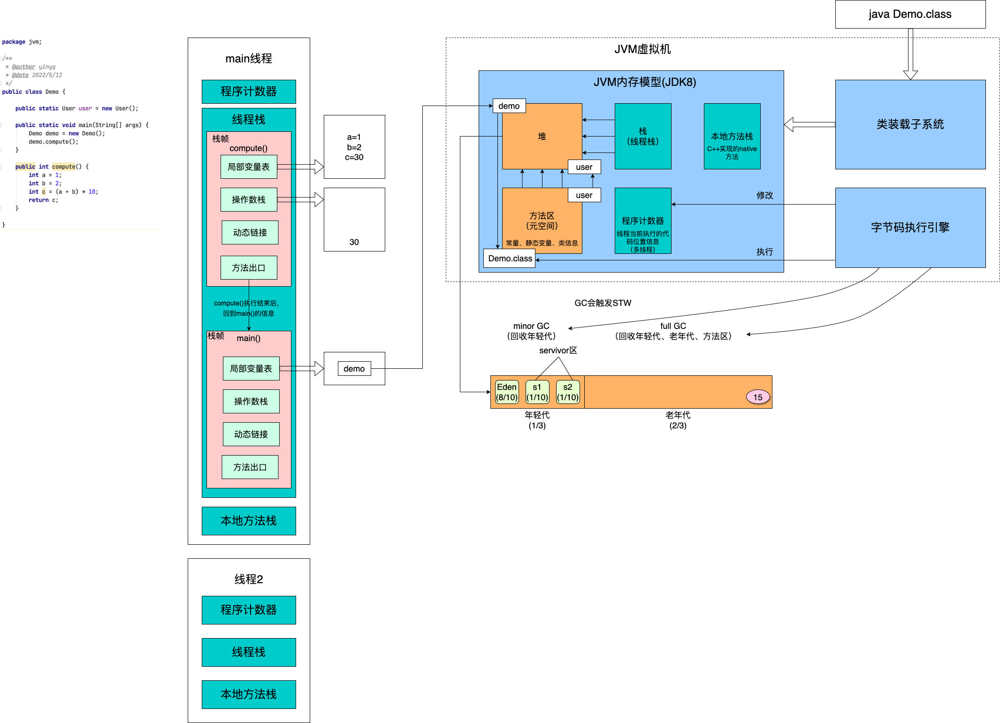
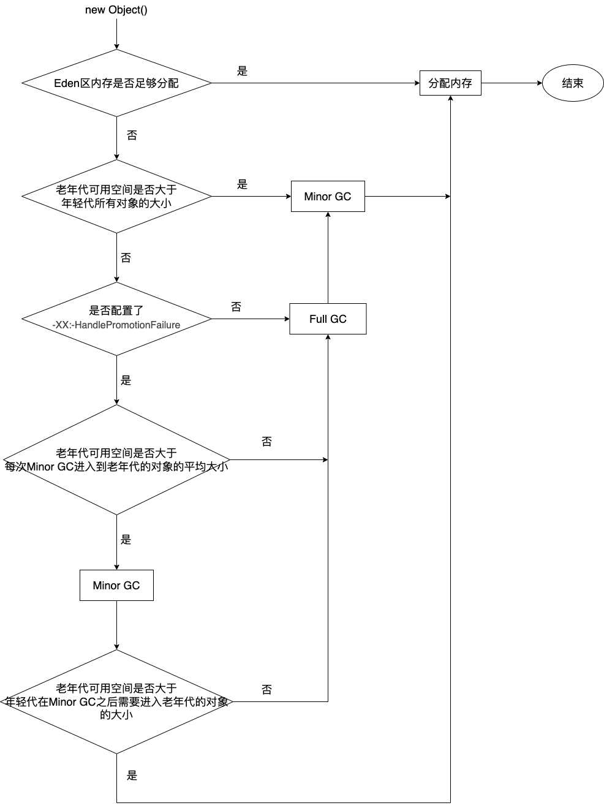

## JVM整体结构及内存模型

## JVM内存参数设置

#### 堆

- **-Xms2048m**: 设置JVM初始堆内存，建议与-Xmx相同，避免每次垃圾回收完成后JVM重新分配内存；
- **-Xmx2048m**: 设置最大堆内存；
- **-Xmn1024m**: 设置年轻代内存。

#### 栈（线程栈）

- **-Xss512k**: 设置线程的栈大小。在相容的物理内存下，减小该值可以生成更多的线程。但是操作系统对一个进程内的线程个数有一定的限制，无法无限生成，一般在3000-5000个。

#### 方法区（元空间）

方法区是JVM规范，所有虚拟机必须遵守。永久代（PermGen space，<=jdk7）、元空间（Metaspace，>=jdk8）是HotSpot对方法区的实现。

- **-XX:MaxMetaspaceSize=256m**: 设置元空间最大内存，默认-1，即不限制，或者说只受限于本地内存大小；
- **-XX:MetaspaceSize=256m**: 设置元空间触发full GC的初始阈值，默认为21m，达到该值就会触发full GC进行类型卸载，同时收集器会对该值进行调整：如果释放了大量的空间，就适当减低该值；如果释放了很少的空间，那么在不超过-XX:MaxMetaspaceSize(如果设置了的话)的情况下，适当提高该值；
- **-XX:PermSize=256m**: 设置永久代初始内存。

由于调整元空间的大小需要full GC，这是非常昂贵的操作，如果应用在启动的时候就发生大量的full GC，通常是由于元空间发生了大小调整，基于这种情况，一般建议在JVM参数中将-XX:MetaspaceSize和-XX:MaxMetaspaceSize设置成一样的值，并设置得比初始值要大，对于8G物理内存的机器来说，一般将这两个值都设置成256m。

## 对象的创建

#### 1、类加载检查

当new一个对象、对象克隆、对象反序列化时，首先检查这个指令的参数是否能在常量池中定位到一个类的符号引用，并检查这个类是否已被加载（加载、验证、准备、解析、初始化）过。如果没有，那必须先加载该类。

#### 2、分配内存

对象所需内存的大小在类加载完成后便可完全确定，为对象分配内存空间，等同于把一块确定大小的内存从JVM堆中划分出来。

**划分内存的方法**：

- **指针碰撞**：如果JVM堆中内存是绝对规整的，所有已使用的内存都放在一边，空闲的内存放在另一边，中间放着一个指针作为分界点的指示器，那所分配的内存就仅仅是把那个指针向空闲空间那边挪动一段与对象大小相等的距离；
- **空闲列表**：如果JVM堆中的内存并不是规整的，已使用的内存和空闲的内存相互交错，那就没办法简单地进行指针碰撞了，虚拟机就必须维护一个列表，记录上哪些内存是可用的，在分配的时候从列表中找到一块足够大的空间划分给对象实例，并更新列表上的记录。

**解决并发问题的方法**：

- **CAS(compare and swap)**: 虚拟机采用CAS配上失败重试的方式保证更新操作的原子性来对分配内存空间的动作进行同步处理；
- **本地线程分配缓冲（Thread Local Allocation Buffer,TLAB）**: 把内存分配的动作按照线程划分在不同的空间之中进行，即每个线程在JVM堆中预先分配一小块内存，通过-XX:+/-UseTLAB参数来设定虚拟机是否使用TLAB(JVM默认会开启-XX:+UseTLAB), -XXTLABSize指定TLAB大小。 

#### 3、初始化

内存分配完成后，虚拟机需要将分配到的内存空间都初始化为零值（不包括对象头），如果使用TLAB，这一工作也可以提前至TLAB分配时进行。这一步保证了对象的实例字段在Java代码中可以不赋初始值就直接使用，程序能访问到这些字段的数据类型所对应的零值。

#### 4、设置对象头

对象在内存中存储的布局可以分为3块区域：对象头、实例数据、对齐填充。

**对象头**

- **Mark Word标记字段**: 32位占4字节，64位占8字节，自身运行时数据：哈希值、GC分代年龄、锁状态标志、线程持有锁、偏向线程ID、偏向时间戳；
- **Klass Pointer类型指针**: 开启压缩占4字节，关闭压缩占8字节，类的元数据的指针；
- **数组长度**: 4字节，只有数组对象才有。

.png)

引用自图灵课程笔记http://note.youdao.com/noteshare?id=0e14c4e1fa9ee6b3fda6da53fd20a04d&sub=1E31F1D71A644ECE84476D66B1E43FE6

**指针压缩**

启用指针压缩: -XX:+UseCompressedOops(默认开启), 禁止指针压缩: -XX:-UseCompressedOops.

- 堆内存小于4G时，不需要启用指针压缩，JVM会直接去除高32位地址，即使用低虚拟地址空间；
- 堆内存大于32G时，指针压缩会失效，会强制使用64位(即8字节)来对对象寻址，这就会增加带宽和GC的压力，所以堆内存不要大于32G为好。

问：为什么要进行指针压缩？

1. 在64位平台的HotSpot中使用32为指针，减少64位平台下内存的消耗，内存使用会多出1.5倍左右；
2. 使用较大指针在主内存和和缓存之间移动数据，占用较大带宽，同时GC也会承受较大压力；
3. 在JVM中，32位地址最大支持4G内存（2的32次方），通过对对象指针的压缩编码、解码方式进行优化，使得JVM只用32位地址就可以支持更大的内存配置（小于等于32G）。

#### 5、执行init方法

执行init方法和构造方法，按照代码为属性赋值，这里与初始化阶段赋零值不同。

## 对象内存分配

#### 栈上分配

**逃逸分析**：当一个对象被外部引用，则称之为逃逸，反之则没有逃逸。对没有逃逸的对象，可以在栈上分配内存，这样该对象所占用的内存空间就会随栈帧出栈而销毁，减轻了垃圾回收的压力。JDK7之后默认开启逃逸分析，-XX:+DoEscapeAnalysis/-XX:-DoEscapeAnalysis.

**标量替换**：没有逃逸的对象，可以进一步被分解，JVM不会创建该对象，而是用若干个被这个方法使用的成员变量所代替，这些代替的成员变量在栈帧或寄存器上分配空间，这样就不会因为没有一大块连续内存空间导致对象内存不够分配。JDK7之后默认开启标量替换，-XX:+EliminateAllocations/-XX:-EliminateAllocations.

#### 对象在Eden区分配

**MinorGC/Young GC**: 回收年轻代垃圾，比较频繁，回收速度较快；

**Full GC/Major GC**: 回收老年代、年轻代、方法区垃圾，速度一般比Minor GC慢10倍以上。

大多数情况下，对象在Eden区分配，如果Eden区内存不够分配，会触发Minor GC，Eden区绝大多数对象会被回收，少部分对象还被引用着，会进入Survivor中的一个区；下一次Minor GC，会回收Eden区和Survivor区垃圾，将存在引用的对象一起转移到Survivor区的另一个区；如果Minor GC过程中，发现Survivor区不能够存放Eden区对象，就会把年轻代对象提前转移到老年代内存空间，只要老年代能够存放Eden区对象，就不会触发Full GC。

Eden区和Survivor区的比例默认是8:1:1，由于年轻代对象是朝生夕死的，存活时间很短，所以JVM的默认比例是很合适的，Eden区尽量的大，Survivor区够用即可。由于JVM默认开启-XX:+UseAdaptiveSizePolicy，这个比例会动态调整，如果不希望动态调整，就添加XX:+-UseAdaptiveSizePolicy参数，关闭动态调整。

#### 大对象直接进入老年代

-XX:PretenureSizeThreshold=1000000: 设置JVM大对象大小，单位是字节，超过这个大小的对象会直接进入老年代内存空间，这个参数只在Serial和ParNew两个收集器下有效。

为什么要这样呢？

为了避免大对象的复制操作影响效率。

#### 长期存活的对象将进入老年代

Eden区的对象，经过Minor GC，被转移到Survivor区后，设置对象年龄为1，对象在Survivor区，每经历一次Minor GC，对象年龄增加1，当对象年龄到一定程度时（默认为15，不同的垃圾收集器略有不同），对象将被转移到老年代内存空间。可以通过参数-XX:MaxTenuringThreshold设置对象被转移到老年代内存空间的年龄。

#### 对象动态年龄判断

如果Survivor区，对象年龄为1+对象年龄为2+...+对象年龄为n的对象，占用的内存空间超过了Survivor区域内存空间的50%，那么对象年龄大于等于n的对象将被转移到老年代内存空间。这个比例可通过参数-XX:TargetSurvivorRatio设置。

目的是为了将长期存活的对象尽早转移到老年代内存空间，对象动态年龄判断一般是在Minor GC之后触发。

#### 老年代空间分配担保机制

当Minor GC后，老年代没有足够的内存空间存放年轻代存活的对象时，就会触发Full GC，如果Full GC后，老年代还是没有足够的内存空间存放年轻代存活的对象，则会发生“OOM”；如果GC后，还是没有足够的内存空间给新对象分配内存空间，则也会发生“OOM”。

## 对象内存回收

#### 引用计数法

给对象添加一个引用计数器，每当有一个地方引用对象，引用计数器就会加1，如果引用失效，引用计数器就会减1。

因为引用计数法很难解决循环引用的问题，导致循环引用的对象的引用计数器都不为0，垃圾回收器无法回收它们，所以目前主流的垃圾回收期都没有选择这个算法。

#### 可达性分析算法

将GC Roots对象作为起点，从这些节点向下搜索引用的对象，找到的对象都标记为非垃圾对象，其余未标记的对象都是垃圾对象。

GC Roots根节点：线程栈的本地变量、静态变量、本地方法栈的变量等等。

#### 常见的引用类型

- **强引用**: 不会被回收;
- **软引用(SoftReference<>)**: 一般不会被回收，当GC无法释放足够的空间存放新对象时，会被回收；
- **弱引用(WeakReference<>)**: 会被直接回收；
- **虚引用**: 也叫幽灵引用、幻影引用，是最弱的引用类型，几乎不用。

#### finalize()

对象被标记回收时执行，只会执行一次。

## 如何判断一个类是无用的类

1. 该类的对象实例都已经被回收；
2. 该类的类加载器ClassLoader已经被回收；
3. 该类的java.lang.Class对象没有被任何地方引用。
