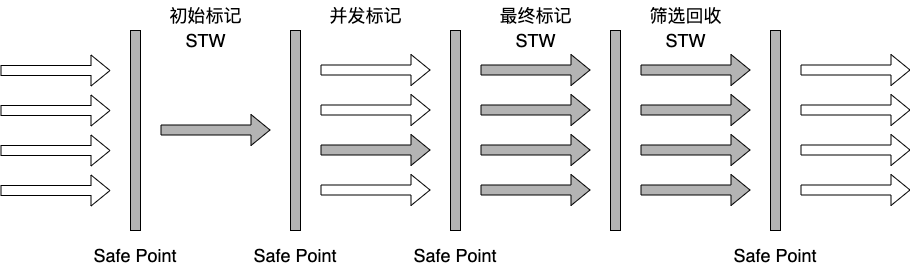
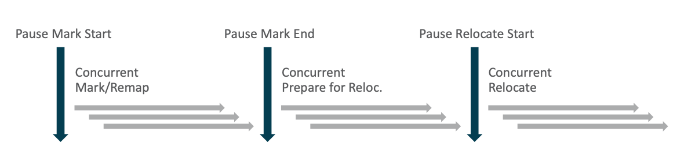

## G1收集器

*<u>图片摘自图灵课程课件</u>*

G1收集器堆内存的划分与之前的收集器不同，它是将堆内存划分为**2048个region**，每个region可能是Eden、Survivor、Old、Humongous，而且在每次GC之后还可能发生变化，**可能从Eden区变为Old区**，其中Humongous区存放的是大对象，即对象大小超过region的50%，并且可以跨多个region存放。

**大对象不会进入老年代空间，而是进入Humongous区**，节省了老年代的空间，较少Full GC。

Full GC除了回收年轻代、老年代内存，也会对Humongous区对象进行回收。

一般region的大小等于堆内存的大小除以2048，可以通过参数-XX:G1HeapRegionSize指定，但是推荐默认大小。

年轻代默认占比为5%，可以通过参数-XX:G1NewSizePercent配置年轻代的初始占比，年轻代的占比不会超过堆内存的60%，可以通过参数-XX:G1MaxNewSizePercent调整。年轻代的Eden去和Survivor区的默认比例仍然是8:1:1。

**初始标记**：同CMS初始标记，初始标记阶段会STW，时间比较短，这个阶段只会扫描GC Roots根节点；

**并发标记**：同CMS并发标记，这个阶段时间比较长，但是不会STW，GC线程和应用程序线程并行，这个阶段会从GC Roots根节点出发，做深度扫描，扫描所有的引用；

**最终标记**：同CMS重新标记，这个阶段也会也会STW，对发生改变的引用再做一次扫描；

**筛选回收**：这个阶段也会STW，但是这个阶段不是一次性对垃圾对象进行回收的，而是执行一段时间后，执行应用程序线程，然后再执行一段时间，这样与应用程序线程交替执行，让用户无感知，提升用户体验。这个阶段会结合参数-XX:MaxGCPauseMillis指定的STW时间，先对各个region做一个估算，估算能够回收的内存大小，以及所需的时间，优先回收耗时小，能够释放更大内存的region，保证STW时间尽可能控制在设定的范围内。并不是对所有的region都进行回收，其余的region，会在下一次GC时，再次根据优先级进行回收。

#### G1收集器的特点

**并行与并发**：利用多核CPU，并行执行，减少STW的时间，提升用户体验；

**分代收集**：G1不需要与其他收集器配合，可以回收整个堆内存，但是保留了分代的概念；

**空间整合**：与CMS的标记清除算法不同，G1从整体上看是标记整理算法，从局部上看是标记复制算法，不会产生内存碎片；

**可预测的停顿**：G1通过估算各个region的回收时间和能够回收的内存大小，优先回收回收价值最大的region，能够做到更优，体验更好的停顿时间。

#### G1收集器的分类

**Young GC**：当Eden去内存无法为新对象分配内存时，G1会先估算回收需要的时间，如果时间远远小于设置的停顿时间，则会增加年轻代的region，当对年轻代回收时间接近停顿时间时，触发Young GC；

**Mixed GC**：当老年代占有率达到参数-XX:InitiatingHeapOccupancyPercent设定的值时，触发Mixed GC，回收全部年轻代、部分老年代（根据设置的停顿时间以及估算的优先级顺序）和大对象区。采用复制算法，将一个region中存活的对象复制到另一个region中，然后清除这个region的内存，如果没有足够的空region完成复制，则会触发Full GC。

**Full GC**：停止用用程序线程，采用单线程进行标记、清除、整理，空闲一批空的region，供Mixed GC使用，Full GC耗时比较长，Shenandoah优化成多线程收集了。

#### 参数

**-XX:+UseG1GC**: 使用G1收集器；

**-XX:ParallelGCThreads**: 指定GC工作的线程数量；

**-XX:G1HeapRegionSiz**e: 指定分区大小(1MB~32MB，且必须是2的N次幂)，默认将整堆划分为2048个分区；

**-XX:MaxGCPauseMillis**: 目标暂停时间(默认200ms)；

**-XX:G1NewSizePercent**: 新生代内存初始空间(默认整堆5%，值配置整数，默认就是百分比)；

**-XX:G1MaxNewSizePercent**: 新生代内存最大空间；

**-XX:TargetSurvivorRatio**: Survivor区的填充容量(默认50%)，Survivor区域里的一批对象(年龄1+年龄2+年龄n的多个年龄对象)总和超过了Survivor区域的50%，此时就会把年龄n(含)以上的对象都放入老年代；

**-XX:MaxTenuringThreshold**: 最大年龄阈值(默认15)；

**-XX:InitiatingHeapOccupancyPercent**: 老年代占用空间达到整堆内存阈值(默认45%)，则执行新生代和老年代的混合收集(MixedGC)，比如我们之前说的堆默认有2048个region，如果有接近1000个region都是老年代的region，则可能就要触发MixedGC了；

**-XX:G1MixedGCLiveThresholdPercent(默认85%)**: region中的存活对象低于这个值时才会回收该region，如果超过这个值，存活对象过多，回收的的意义不大；

**-XX:G1MixedGCCountTarget**: 在一次回收过程中指定做几次筛选回收(默认8次)，在最后一个筛选回收阶段可以回收一会，然后暂停回收，恢复系统运行，一会再开始回收，这样可以让系统不至于单次停顿时间过长；

**-XX:G1HeapWastePercent(默认5%)**: gc过程中空出来的region是否充足阈值，在混合回收的时候，对Region回收都是基于复制算法进行的，都是把要回收的Region里的存活对象放入其他Region，然后这个Region中的垃圾对象全部清理掉，这样的话在回收过程就会不断空出来新的Region，一旦空闲出来的Region数量达到了堆内存的5%，此时就会立即停止混合回收，意味着本次混合回收就结束了。

#### -XX:MaxGCPauseMillis

如果设置的太小，每次GC只能释放很少的内存空间，会频繁触发Young GC，还可能造成内存利用率低；

如果设置的太大，可能导致程序运行了很长时间，年轻代占用了60%的堆内存，才触发Young GC，存活的对象非常多，Survivor不够存放，这些对象会直接进入老年代；或者进入到Survivor区的对象太多，触发了动态年龄判断，一部分对象会快速进入到老年代。

总的来说，合理的设置-XX:MaxGCPauseMillis，既不能频繁触发Young GC，也要考虑避免太多的对象快速进入老年代，频繁触发Mixed GC。

## ZGC收集器

#### 目标

- 支持TB量级的堆；
- 最大GC停顿时间不超过10ms；
- 奠定未来GC特性的基础；
- 最糟糕的情况下吞吐量会降低15%。

#### ZGC内存布局

ZGC暂时是不分代的。

**小型Region**：容量固定为2MB，用于放置喜爱与256KB的对象；

**中型Region**：容量固定为32MB，用于防止大于等于256KB，小于4MB的对象；

**大型Region**：容量不固定，可以动态变化，必须为2MB的整数倍，用于放置大于等于4MB的对象。每个大型Region只会存放一个对象。因为复制一个大对象的代价非常高昂，所以大型Region在ZGC的实现中不会被重分配。

#### ZGC运作过程

主要分为并发标记、并发预备重分配、并发重分配、并发重映射4个阶段，这4个阶段都是可以并发执行的，这几个阶段之间，包含Mark Start、Mark End会有短暂的停顿。

并发标记：与CMS、G1并发阶段一样，从GC Roots出发，做深度扫描，做可达性分析；

并发预备重分配：分析哪些Region需要被重分配，将这些Region收集到重分配集中；

并发重分配：将重分配集中的Region，存活的对象复制到其他Region，并维护转发表，记录对象在新Region中的内存地址。当一个Region中存活的对象复制完成，就可以回收该Region，但是转发表需要保留，因为可能还存在着对这些对象的引用；

并发重映射：将对被重分配的对象的指针修正到当前真正的内存地址。因为转发表存在，对这些指针的修正不是很迫切，所以ZGC将并发重映射放在下一次GC的并发标记阶段完成，因为并发标记阶段本来就需要做深度扫描。当所有的指针都被修正后，这些转发表就可以释放掉了。

#### 颜色指针

前面的收集器的GC信息保存在对象头，而ZGC的GC信息保存在指针中。每个对象有一个64位指针，ZGC用其中的2位做标记位。

**18位**：未使用，预留给以后使用；

**1位**：标记是都只能通过fi'na'li'ze()方法才能被访问到；

**1位**：标记是否进入了重分配集，即被移动过；

**1位**：Marked1标识；

**1位**：Marked0标识；

**42位**：对象地址（2^42=4TB）。

不能支持32位平台，不能支持指针压缩。

**颜色指针的三大优势**：

1. 可以使得一旦某个Region的存活对象被移走之后，这个Region立即就能够被释放和重用掉，而不必等到整个堆中所有指向该Region的引用都被修正后才能清理掉。使得理论上只要还有一个空闲Region，ZGC就能完成收集；
2. 可以大幅减少在垃圾手机构成中内存屏障的使用数量，到目前为止ZGC都并未使用任何写屏障，只使用了读屏障（一部分是颜色指针的功劳，一部分是ZGC现在还不支持分代收集，天然就没有跨代引用的问题）；
3. 颜色指针可以作为一种可扩展的存储结构用来记录更多与对象标记、重定位过程相关的数据，以便日后进一步提高性能。

#### 读屏障

在标记和移动对象的阶段，每次从堆里对象的引用类型中读取一个指针的时候，都需要加上一个读屏障。

#### ZGC存在的问题

ZGC存在的最大问题是浮动垃圾。

#### ZGC触发时机

定时触发：默认为不使用，通过ZCollectionInterval参数配置；

预热触发：最多三次，在堆内存达到10%、20%、30%时触发，主要是统计GC时间，为其他GC机制使用；

分配速率：基于正太分布统计，计算内存99.9%可能的最大分配速率，以及此速率下内存将要耗尽的时间点，在耗尽之前触发GC（耗尽时间 - 一次GC最大持续时间 - 一次GC检测周期时间）；

主动触发：默认开启，可通过ZProactive参数配置。距上次GC堆内存增长10%，或超过5分钟时，对比距上次GC的间隔时间跟（49 * 一次GC的最大持续时间），超时则触发。

#### 安全点与安全域

**安全点**

指代码中一些特定的位置，当线程运行到这些位置时它的状态是确定的，这样JVM就可以安全的进行一些操作，比如GC等，所以GC不是想什么时候做就立即触发的，是需要等待所有线程运行到安全点后才能触发。

不直接对线程操作，仅仅简单地设置一个标志位，各个线程执行过程时会不停地主动去轮询这个标志，一旦发现中断标志为真时就自己在安全点上主动中断挂起，轮询标志的地方和安全点是重合的。

**特定的安全点位置**：

1. 方法返回之前；
2. 调用某个方法之后；
3. 抛出异常的位置；
4. 循环的末尾。

**安全域**

指在一段代码片段中，引用关系不会发生变化。在这个区域内的任意地方开始GC都是安全的。

