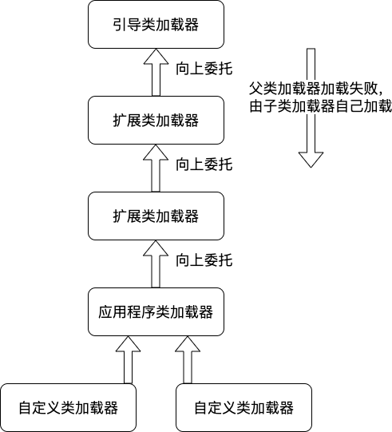

## 类加载运行全过程

#### loadClass的类加载过程

**加载 >> 验证 >> 准备 >> 解析 >> 初始化** >> 使用 >> 卸载

- **加载**：在硬盘上查找并通过IO读入字节码文件，使用到类时才会加载，例如调用类的main()方法，new对象等等，在加载阶段会在内存中生成一个代表这个类的java.lang.Class对象，作为方法区这个类的各种数据的访问入口；
- **验证**：校验字节码文件的正确性；
- **准备**：给类的静态变量分配内存，并赋予默认值（JVM规范建议在初始化阶段给常量赋值，但是HotSpot VM直接在准备阶段就赋值了）；
- **解析**：将符号引用替换为直接引用，该阶段会把一些静态方法(符号引用，比如main()方法)替换为指向数据所存内存的指针或句柄等(直接引用)，这是所谓的静态链接过程(类加载期间完成)，动态链接是在程序运行期间完成的将符号引用替换为直接引用；
- **初始化**：对类的静态变量初始化为指定的值，执行静态代码块。

类被加载到方法区中后主要包含运行时常量池、类型信息、字段信息、方法信息、类加载器的引用、对应class实例的引用等信息。

类加载器的引用：这个类到类加载器实例的引用。

对应class实例的引用：类加载器在加载类信息放到方法区中后，会创建一个对应的Class类型的对象实例放到堆(Heap)中，作为开发人员访问方法区中类定义的入口和切入点。

注意，主类在运行过程中如果使用到其它类，会逐步加载这些类。

jar包或war包里的类不是一次性全部加载的，是使用到时才加载。

## 类加载器和双亲委派机制

#### Java的集中类加载器

- **引导类加载器**：负责加载支撑JVM运行的位于JRE的lib目录下的核心类库，比如rt.jar、charsets.jar等；
- **扩展类加载器**：负责加载支撑JVM运行的位于JRE的lib目录下的ext扩展目录中的JAR类包；
- **应用程序类加载器**：负责加载classPath路径下的类包，主要就是加载你自己写的那些类；
- **自定义类加载器**：负责加载用户自定义路径下的类包。

#### 类加载器初始化过程

参见类加载运行全过程图可知其中会创建JVM启动器实例sun.misc.Launcher。

Sun.misc.Launcher初始化使用了单例模式，保证一个JVM虚拟机内存只有一个sun.misc.Launcher实例。

在Launcher构造方法内部，其创建了两个类加载器，分别是sun.misc.Launcher.ExtClassLoader(扩展类加载器)和sun.misc.Launcher.AppClassLoader(应用程序类加载器)。

JVM默认使用Launcher的getClassLoader()方法返回的类加载器AppClassLoader的实例加载我们的应用程序。

#### 双亲委派机制

1. AppClassLoader检查该类是否已被加载，如果已被加载，则返回该类的对象实例，如果没有，则委托父类加载器ExtClassLoader加载；
2. ExtClassLoader检查该类是否已被加载，如果已被加载，则返回该类的对象实例，如果没有，则委托父类加载器引导类加载器加载；
3. 引导类加载器检查该类是否已被加载，如果已被加载，则返回该类的对象实例，如果没有，则加载并返回该类，如果没有找到该类文件，则由子类加载器ExtClassLoader自己加载；
4. ExtClassLoader加载并返回该类，如果没有找到该类文件，则由子类加载器AppClassLoader自己加载；
5. AppClassLoader加载并返回该类，如果没有找到该类文件，则抛出ClassNotFoundException。

#### 为什么要设计双亲委派机制？

**沙箱安全机制**：自己写的java.lang.String.class类不会被加载，这样便可以防止核心API库被随意篡改；

**避免类的重复加载**：当父类加载器已经加载了该类时，就没有必要子类加载器再加载一次，保证被加载类的唯一性。

#### 全盘负责委托机制

“全盘负责”是指当一个类加载器加载一个类时，除非显示的使用另一个类加载器，该类所依赖及引用的类也由这个类加载器加载。

#### 自定义类加载器

继承java.lang.ClassLoader:

- **loadClass(String name, boolean resolve)**: 实现了双亲委派机制，如果想打破双亲委派机制，需要重写该方法；
- **findClass(String name)**: 默认实现是空方法，自定义类加载器需要重写该方法。

#### Tomcat类加载机制

Tomcat类加载机制为了实现隔离性，没有遵守Java推荐的双亲委派模型，每个WebAppClassLoader加载自己目录下的class文件，不会传递给父类加载器，打破了双亲委派机制。

