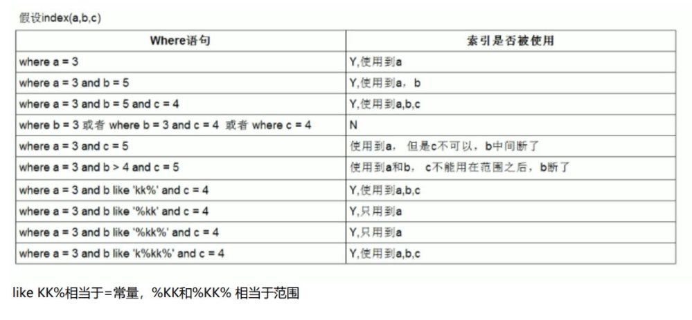

#### id

id列的编号是select的序列号，有几个select就有几个id，并且id的顺序是按select出现的顺序增长的。**id类越大执行优先级越高，id相同则从上往下执行，id为Null最后执行**。

#### select_type

1. simple：简单查询。查询不包含子查询和union；
2. primary：复杂查询中最外层的select；
3. subquery：包含在select中的子查询（不在from子句中）；
4. derived：包含在from子句中的子查询。MySQL会将结果存放在一个临时表中，也称为派生表（derived的英文含义）；
5. union：在union中的第二个和随后的select。

#### table

这一列表示explain的一行正在访问哪个表。

当from子句中有子查询时，table列是\<derivedN\>格式，表示当前查询依赖id=N的查询，于是限制性id=N的查询。

当有union是，UNION RESULT的table列的值为\<union1,2\>，1和2表示参与union的select行id。

#### type

这一列表示**关联类型或访问类型**。

system > const > eq_ref > ref > range > index > ALL。

一般来说，保证查询达到range级别，最好达到ref。

**Null：**MySQL能够在优化阶段分解查询语句，在执行阶段无需再访问表或索引。例如：在索引中选取最小值，可以单独查询索引来完成，不需要在执行阶段访问表。

**const，system：**MySQL能对查询的某部分进行优化并将其转化成一个常量（可以看show warnings的结果）。用于primary key或unique key的所有列与常数比较时，所以表最多有一个匹配行，读取一次，速度比较快，**system是const的特例**，表里只有一条元祖匹配时为system。

**eq_ref：**primary key或union key索引的所有列被联接使用，最多只会返回一条符合条件的记录。这可能是在const之外最好的联接类型了，简单的select查询不会出现这种type。

**ref：**相比eq_ref，不使用唯一索引，而是使用普通索引或者唯一索引的部分前缀，索引要和某个值相比较，可能会找到多个符合条件的行。

**range：**范围扫描通常出现在in、between、>、<、>=等操作中。使用一个索引来检索给定范围的行。

**index：**扫描全索引就能拿到结果，一般是扫描某个二级索引，这种扫描不会从索引树根节点开始快速查找，而是直接对二级索引的叶子节点遍历和扫描，速度还是比较慢的，这种查询一般为使用覆盖索引，二级索引一般比较小，所以这种通常比ALL快一些。

**ALL：**即全表扫描，扫描你的聚簇索引的所有叶子节点。通常情况下这需要增加索引来进行优化了。

#### possible_keys

这一列显示了查询可以使用哪些索引。

#### key

这一列显示了MySQL决定采用哪个索引来优化对该表的访问。

如果该索引没有出现早possible_keys列中，那么MySQL选用它是出于另外的原因--例如，它可能选择了一个覆盖索引，哪怕没有WHERE子句。

#### key_len

这一列显示了MySQL在索引里使用的字节数，通过这个值可以算出具体使用了索引中的哪些列。

#### ref

这一列显示了再key列记录的索引中，表查找值锁用到的列或常量，常见的有const（常量）、字段名（具体的字段名）。

#### rows

这一列是MySQL估计要读取并检测的行数，注意这个不是结果集里的行数。

#### filtered

百分比值，rows * filtered / 100可以估算除将要和explain中前一个表进行联接的行数（前一个表指explain中id值比当前表小的表）。

#### Extra

这一列展示的是额外信息。

**Using index：**使用覆盖索引。

**Using where：**这意味着MySQL服务器将在存储引擎检索行后再进行过滤。许多WHERE条件里涉及索引中的列，当（并且如果）它读取索引时，就能被存储引擎检验，因此不是所有带WHERE子句的查询都会显示“Using where”。有时“Using where”的出现就是一个暗示：查询可受益于不同的索引。

**Using index condition：**查询的列不完全被索引覆盖，where条件中是一个前导列的范围。

**Using temporary：**MySQL需要创建一张临时表来处理查询。出现这种情况一般是要进行优化的，首先是想到用索引来进行优化。

**Using filesort：**将用外部排序而不是索引排序，数据比较小时从内存排序，否则需要在磁盘完成排序。这种情况下一般也是要考虑使用索引来优化的。

**Select tables optimized away：**使用聚合函数（比如max、min）来访问存在索引的某个字段时。

#### 覆盖索引

如果一个索引包含（或者说覆盖）所有需要查询的字段的值，我们就称之为“覆盖索引”。

#### 索引最佳实践

- 全值匹配；
- 最左前缀法则；
- 不在索引列上做任何操作（计算、函数（自动or手动）类型转换），会导致索引失效而转向全表扫描；
- 存储引擎中不能使用索引中范围条件右边的列；
- 尽量使用覆盖索引（只访问索引的查询（索引列包含查询列）），减少select *语句；
- MySQL在使用不等于（!=或者<>），not in、not exists的时候无法使用索引会导致全表扫描，<小于、>大于、<=、>=这些，MySQL内部优化器会根据检索比例、表大小等多个因素整体评估是否使用索引；
- is null，is not null一般情况下也无法使用索引；
- like以通配符开头（'%abc...'）MySQL索引失效会变成全表扫描操作；
- 字符串不加引号索引失效；
- 少用or或in，用它查询时，MySQL不一定使用索引，MySQL内部优化器会根据检索比例、表大小等多个因素整体评估是否使用索引，详见范围查询优化；
- 范围查询优化：可以将大的范围拆分成多个小范围。

#### 索引使用总结

