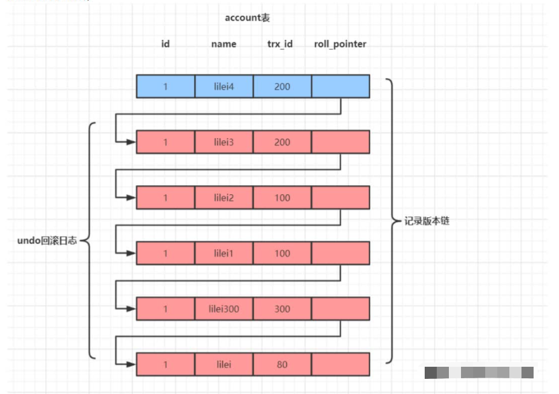

## MVCC多版本并发控制（Muiti-Version Concurrency Control）机制

MySQL在读已提交和可重复读隔离级别下都实现了MVCC机制。MVCC机制保证同样的SQL查询语句在一个事务里多次查询结果相同，MVCC机制对一行数据的读和写两个操作默认是不会通过加锁互斥来保证隔离性，避免了频繁加锁互斥。

## undo日志版本链与read view机制详解

undo日志版本链是指一行数据被多个事务依次修改过后，在每个事务修改完成后，MySQL会白柳修改前的数据undo回滚日志，并用两个隐藏字段trx_id和roll_pointer把这些undo日志串联起来形成一个历史记录版本链（见下图）。

在可重复读隔离级别，当事务开启，执行任务**查询SQL**时会生成当前事务的一致性视图（read-view），该视图在事务结束之前都不会变化（如果是读已提交隔离级别，每次执行查询SQL时都会重新生成），这个视图由执行查询时所有未提交事务id数组（数组里细小的id为min_id)和已创建的最大事务id(max_id)组成，事务里的任何SQL查询结果需要从对应版本链里的最新数据开始逐条跟read-view做比对而得到最终的快照结果。

**版本链比对规则：**

1. 如果row的trx_id<min_id，表示这个版本是已提交的事务生成的，这个数据是可见的；
2. 如果row的trx_id>max_id，表示这个版本是由将来启动的事务生成的，这个数据是不可见的（但是如果row的trx_id是当前事务自己的trx_id，这个数据是可见的）；
3. 如果row的trx_id在[min_id, max_id]区间：

​		a.如果row的trx_id在视图数组中，表示这个版本是有还没有提交的事务生成，这个数据是不可见的（但是如		果row的trx_id是当前事务自己的trx_id，这个数据是可见的）；

​		b.如果row的trx_id不在视图中，表示这个版本是已经提交了的事务生成的，这个数据是可见的。

## InnoDB引擎SQL执行的BufferPool缓存机制

为什么MySQL不能直接更新磁盘上的数据而且设置这么一套复杂的机制来执行SQL？

1. 直接更新磁盘文件进行随机读写，数据性能可能相当差，不能让数据库支撑很高的并发；
2. 这套机制看起来复杂，但它可以保证每个更新请求都是更新内存BufferPool，然后顺序写日志文件，同事还能保证各种异常情况下的数据一致性；
3. 更新内存的性能是极高的，顺序写磁盘上的日志文件性能也是非常高的，要远高于随机读写磁盘文件。正事通过这套机制，才能让MySQL数据库在较高配置的机器上每秒可以支撑几千的读写请求。

