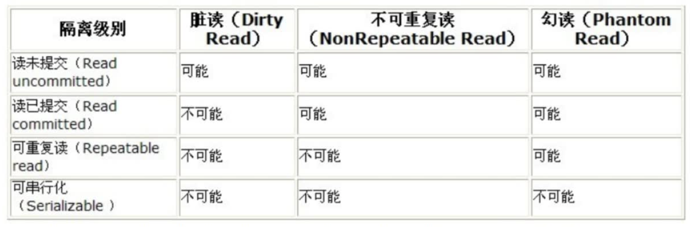

## 事务及其ACID属性

事务是由一组SQL语句组成的逻辑处理单元，事务具有以下4个属性，通常简称为事务的ACID属性。

- 原子性(Atomicity)：事务是一个原子操作单元，其对数据的修改，要么全都执行，要么全都不执行。关注的是操作。
- 一致性(Consistent)：在事务开始和完成时，数据都必须保持一致状态。事务对数据的修改，要么全都修改成功，要么全都回滚。关注的是结果。
- 隔离性(Isolation)：数据库系统提供一定的隔离机制，保证事务在不受外部并发操作影响的“独立”环境执行。这意味着事务处理过程中的中间状态对外部是不可见的，反之，事务从开始到结束前，也感知不到外部的变化。
- 持久性(Durable)：事务完成之后，它对于数据的修改是永久性的，即使出现系统故障也能够保持。


## 并发事务处理带来的问题

更新丢失(Lost Update)或脏写：多个事务对同一行记录进行更新，最后的更新覆盖了由其他事务所做的更新。

脏读（Dirty Reads）：事务A读取到了事务B已经修改但尚未提交的数据。

不可重复读（Non-Repeatable Reads）：事务A内部的相同查询语句在不同时刻读出的结果不一致，不符合隔离性。

幻读（Phantom Reads）：事务A读取到了事务B提交的新增数据，不符合隔离性。


## 事务隔离级别




## 锁详解

锁是计算机协调多个进程或线程并发访问某一资源的机制。


## 锁分类

- 性能上：                                                   乐观锁（用版本对比来实现）、悲观锁；

- 对数据库操作类型（都属于悲观锁）：读锁（共享锁、S锁（Shared））

  ​								   							   写锁（排他锁、X锁（eXclusion））；

- 对数据操作的粒度：                               表锁、行锁。


## 表锁

每次操作锁住整张表。开销小，加锁快；不会出现死锁；锁定粒度大，发生锁冲突的概率最高，并发读最低；一般用在对整张表数据迁移的场景。

加锁：       lock table 表名 read/write, 表名2 read/write;

查看表锁：show open tables;

删除表锁：unlock tables;


## 行锁

每次操作锁住一行数据。开销大，加锁慢；会出现死锁；锁定粒度最小，发生锁冲突的概率最低，并发度最高。

PS: 锁主要是加在索引上，如果对非索引字段更新，行锁可能会变表锁。


## InnoDB与MyISAM的不同点

- InnoDB支持事务，MyISAM不支持事务；
- InnoDB支持行锁，MyISAM不支持行锁。
- InnoDB对select语句不会加锁（非可串行化隔离级别），MyISAM对select语句涉及到的所有表加读锁；
- InnoDB对insert、update、delete语句加行锁，MyISAM对insert、update、delete涉及到的所有表加写锁。


间隙锁(Gap Lock)与临键锁(Next-key Locks)

**间隙锁(Gap Lock)：**如果是where条件是一个范围，会锁住范围所包含的所有行记录，同时会锁住间隙行记录以及行记录所在的间隙。**间隙锁还在可重复读隔离级别下才会生效**。

**临键锁(Next-key Locks)：**行锁与间隙锁的组合。

**例子：**如果t_user表存在1、2、3、10、20这些id，则存在(3, 10)、(10, 20)、(20, 正无穷)这些间隙。那么当某个事务执行update user set username = 'xxx' where id > 8 and id < 18，则其他事务无法在(3, 20]这个区间修改或新增数据。


## 行锁分析

```mysql
show status like 'Innodb_row_lock%';
```

状态量说明：

**Innodb_row_lock_time: 从系统启动到现在锁定总时间长度**

**Innodb_row_lock_time_avg: 每次等待所花平均时间**

**Innodb_row_lock_waits: 系统启动后到现在总共等待的次数**

Innodb_row_lock_current_waits: 当前正在等待锁定的数量

Innodb_row_lock_time_max: 从系统启动到现在等待最长的一次所花时间


## 查看INFORMATION_SCHEMA系统库锁相关数据表

```mysql
‐‐ 查看事务
select * from INFORMATION_SCHEMA.INNODB_TRX;
‐‐ 查看锁
select * from INFORMATION_SCHEMA.INNODB_LOCKS;
‐‐ 查看锁等待
select * from INFORMATION_SCHEMA.INNODB_LOCK_WAITS;
‐‐ 释放锁，trx_mysql_thread_id可以从INNODB_TRX表里查看到
kill trx_mysql_thread_id;
‐‐ 查看锁等待详细信息
show engine innodb status;
```


## 锁优化建议

- 尽可能让所有数据检索都通过索引来完成，避免无索引行锁升级为表锁；
- 合理设计索引，尽量缩小锁的范围；
- 尽可能减少检索条件范围，避免间隙锁；
- 尽量控制事务大小，减少锁定资源量和时间长度，涉及事务加锁的sql尽量放在事务最后执行；
- 尽可能低级别事务隔离。

