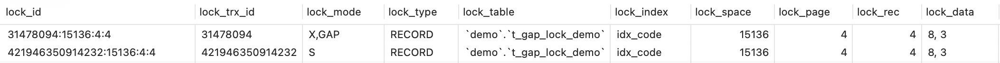

# 锁

## InnoDB Locking

本文描述基于MySQL5.7，事务隔离级别为REPEATABLE READ。

MySQL官方文档: https://dev.mysql.com/doc/refman/5.7/en/innodb-locking.html

### Shared and Exclusive Locks(共享锁与排它锁)

**共享锁(S)**是指不同的事务可以同时持有同一对象的共享锁。

**排它锁(X)**是指不同的事务不可以同时持有同一对象的锁，这里又分为2种情况：

- 当事务1已经持有对象A的排它锁，事务2想要获得对象A的共享锁或排它锁，事务2将被阻塞，直到事务1释放了对象A的排它锁。
- 当事务1已经持有对象A的共享锁，事务2想要获得对象A的排它锁，事务2将被阻塞，直到事务1释放了对象A的排它锁，但是如果事务2想要获得对象A的共享锁，事务2将会立即获得对象A的共享锁。


### Intention Locks(意向锁)

意向锁表示一种意图，分为**意向共享锁(IS)**、**意向排它锁(IX)**。

获取某一行记录的共享锁时，首先会获得该表的意向共享锁；获取某一行记录的排它锁时，首先会获得该表的意向排它锁。

意向锁不会阻塞除全表操作以外的任何操作，这里的全表操作指lock tables table_name read/write。

意向锁(IS、IX)与表锁(S、X)的兼容性如下:

|        | **X** | **IX** | **S** | **IS** |
| ------ | ----- | ------ | ----- | ------ |
| **X**  | 冲突  | 冲突   | 冲突  | 冲突   |
| **IX** | 冲突  | 兼容   | 冲突  | 兼容   |
| **S**  | 冲突  | 冲突   | 兼容  | 兼容   |
| **IS** | 冲突  | 兼容   | 兼容  | 兼容   |

**show engine innodb status**:

```mysql
TABLE LOCK table `test`.`t` trx id 10080 lock mode IX
```


### Record Locks(记录锁)

记录锁锁定的是一条索引记录，可以是共享锁，也是可以是排它锁。

从show engine innodb status可以看到如下的日志，注意其中的**locks rec but not gap**，表示锁定的是一条记录而不是间隙。

```mysql
RECORD LOCKS space id 58 page no 3 n bits 72 index `PRIMARY` of table `test`.`t`
trx id 10078 lock_mode X locks rec but not gap
Record lock, heap no 2 PHYSICAL RECORD: n_fields 3; compact format; info bits 0
0: len 4; hex 8000000a; asc     ;;
1: len 6; hex 00000000274f; asc     'O;;
2: len 7; hex b60000019d0110; asc        ;;
```


### Gap Locks(间隙锁)

当对一条索引记录加上记录锁时，同时也会对其前后间隙加上间隙锁。如果当前记录不存在，也会对所属区间加上间隙锁。

间隙锁阻止其它事务在区间内插入新的数据，区间遵循左闭右开。

当使用唯一索引的全部字段检索数据时，这里不使用间隙锁，仅仅使用记录锁。

这里值得注意的是，在一个间隙上，冲突的锁可以被不同的事务同时获取。例如，事务1可以获取间隙上的S锁，事务2可以获取同一间隙上的X锁。

<span style="font-size:20px">**下面是一个间隙锁的demo**</span>

表t_gap_lock_demo已经存在3、5、8、10这些记录，当对记录8加上记录锁时，同时也会对[5, 8)、(8, 10)这两个区间加上间隙锁。

**表结构与数据**:

```mysql
drop tables if exists t_gap_lock_demo;
create table t_gap_lock_demo(
	id bigint not null primary key auto_increment,
	code bigint not null,
	index idx_code(code)
);
insert into t_gap_lock_demo(code) values(3);
insert into t_gap_lock_demo(code) values(5);
insert into t_gap_lock_demo(code) values(8);
insert into t_gap_lock_demo(code) values(10);
```

**说明**: 当前索引3、5、8、10；事务1锁定索引记录8，则区间[5, 8)、(8, 10)也会被加上间隙锁；事务2如果要在此区间执行insert操作，会被阻塞，而delete、update操作不会受影响。

| Transaction 1                                                | Transaction 2                                                |
| ------------------------------------------------------------ | ------------------------------------------------------------ |
| begin;                                                       | begin;                                                       |
| select * from t_gap_lock_demo where code = 8 lock in share mode; |                                                              |
|                                                              | insert into t_gap_lock_demo(code) values(5); -- 阻塞(间隙锁)<br/>insert into t_gap_lock_demo(code) values(7); -- 阻塞(间隙锁)<br/>insert into t_gap_lock_demo(code) values(8); -- 阻塞(记录锁)<br/>insert into t_gap_lock_demo(code) values(9); -- 阻塞(间隙锁)<br/>insert into t_gap_lock_demo(code) values(10); -- 不阻塞<br/><br/>select * from t_gap_lock_demo where code = 7 for update; -- 不阻塞<br/>select * from t_gap_lock_demo where code = 8 for update; -- 阻塞(记录锁)<br/><br/>delete from t_gap_lock_demo where code = 7; -- 不阻塞<br/>delete from t_gap_lock_demo where code = 8; -- 阻塞(记录锁) |
| commit;                                                      | commit;                                                      |

**可以通过下面的语句查看事务与锁信息**:

```mysql
select * from information_schema.INNODB_TRX; -- 查看当前活跃的事务信息
select * from information_schema.INNODB_LOCKS; -- 查看当前加锁信息
select * from information_schema.INNODB_LOCK_WAITS; -- 查看当前锁等待信息
show engine innodb status;
```

**select * from information_schema.INNODB_LOCKS**:



**show engine innodb status**:

```mysql
RECORD LOCKS space id 15136 page no 4 n bits 72 index idx_code of table `demo`.`t_gap_lock_demo` trx id 31478094 lock_mode X locks gap before rec insert intention waiting
Record lock, heap no 4 PHYSICAL RECORD: n_fields 2; compact format; info bits 0
 0: len 8; hex 8000000000000008; asc         ;;
 1: len 8; hex 8000000000000003; asc         ;;
```


### Insert Intention Locks(插入意向锁)

插入意向锁表示一种插入意向，在插入数据之前，先检查是否存在间隙锁，获取插入意向锁。

这里需要特别说明的是，当线程1已经插入数据，此时线程2想要获取当前间隙的间隙锁，或者在当前间隙插入其他数据，线程2不会阻塞。间隙锁可能在插入操作完成后即释放，无需等待事务(未找到相关资料，供参考)。

当发生唯一索引重复时，会给当前索引记录加上S锁(MySQL官方文档: https://dev.mysql.com/doc/refman/5.7/en/innodb-locks-set.html )。这种场景同时也会给唯一索引以及主键索引加上间隙锁(这里是实际demo发现的，未找到相关资料，供参考)。

**表结构与数据**:

```mysql
drop tables if exists t_gap_lock_demo;
create table t_gap_lock_demo(
	id bigint not null primary key auto_increment,
	code bigint not null,
	unique index uniq_code(code)
);
insert into t_gap_lock_demo(id, code) values(3, 3);
insert into t_gap_lock_demo(id, code) values(5, 5);
insert into t_gap_lock_demo(id, code) values(8, 8);
insert into t_gap_lock_demo(id, code) values(10, 10);
```

**事务描述**:

| Transaction 1                                       | Transaction 2                                        |
| --------------------------------------------------- | ---------------------------------------------------- |
| begin;                                              | begin;                                               |
| insert into t_gap_lock_demo(id, code) values(6, 5); |                                                      |
|                                                     | insert into t_gap_lock_demo(id, code) values(7, 30); |
| commit;                                             | commit;                                              |

**select * from information_schema.INNODB_LOCKS**:


**show engine innodb status**:

```mysql
RECORD LOCKS space id 15196 page no 3 n bits 72 index PRIMARY of table `demo`.`t_gap_lock_demo` trx id 31479331 lock_mode X locks gap before rec insert intention waiting
Record lock, heap no 4 PHYSICAL RECORD: n_fields 4; compact format; info bits 0
 0: len 8; hex 8000000000000008; asc         ;;
 1: len 6; hex 000001e0561b; asc     V ;;
 2: len 7; hex ee000065030110; asc    e   ;;
 3: len 8; hex 8000000000000008; asc         ;;
```


### Next-Key Locks(临键锁)

临键锁就是记录锁+间隙锁。


### AUTO-INC Locks(自增锁)

自增锁是一种表级别的锁。

自增锁在语句执行完就释放了，无需等待事务结束。

**insert语句的分类**:

| 分类               | 说明                                                         |
| ------------------ | ------------------------------------------------------------ |
| INSERT-like        | 包含以下三种                                                 |
| Simmple inserts    | single-row(插入单行)、没有指定自增列且提前知道行数的多行插入 |
| Bulk inserts       | INSERT ... SELECT                                            |
| Mixed-mode inserts | INSERT ... ON DUPLICATE KEY UPDATE、部分指定自增列的多行插入 |

**innodb_autoinc_lock_mode**:

- innodb_autoinc_lock_mode = 0 (“traditional” lock mode)

​		这种模式的行为类似innodb_autoinc_lock_mode被引入之前，所有insert语句都使用自增锁。

- innodb_autoinc_lock_mode = 1 (“consecutive” lock mode)

​		对于Simmple inserts，不使用自增锁，而是使用一个互斥量。这个互斥量，可以认为是一个轻量级的锁，在获取所需数量的连续的自增值之后，即释放锁，无需等待语句执行完。这里不使用自增锁，但是需要检查是否有其他线程持有自增锁，如果有，则需要等待其他线程释放自增锁。

​		对于Bulk inserts，使用自增锁，获取所需的连续的自增值，并在语句执行完释放自增锁，无需等待事务结束。

​		对于Mixed-mode inserts，使用自增锁，获取连续的自增值，这里获取的自增值数量可能比实际需要的数量要多。

- innodb_autoinc_lock_mode = 2 (“interleaved” lock mode)

​		这种模式下，所有的insert语句都使用互斥量。这种模式下，一条语句获取的自增值可能不是连续的，且多个语句并发执行时，自增值可能存在间隙。


## 补充

### 外键约束与锁

当一条语句对含有外键的表进行插入、更新、删除操作时，会一行一行的做外键约束检查，做外键约束检查时，会对子表或父表设置S锁。

 MySQL官方文档: https://dev.mysql.com/doc/refman/5.7/en/ansi-diff-foreign-keys.html

