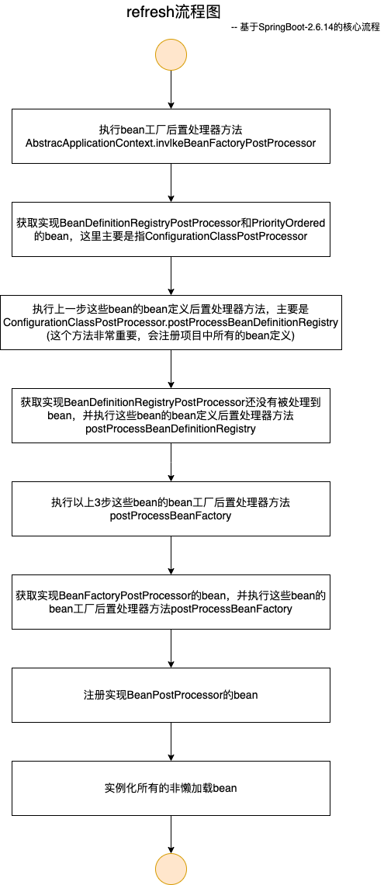

refresh方法是SpringBoot最核心的一个方法，负责Spring容器中各种bean的实例化、填充属性、初始化，还包含了AOP的实现。

本文以下内容基于SpringBoot-2.6.14版本，不同的版本实现细节可能存在差异，但是核心内容大致相同。

# 流程图



# 分步解析

先来看一下refresh方法的代码，其中最为核心的逻辑，我添加了中文注释。

```java
public void refresh() throws BeansException, IllegalStateException {
		synchronized (this.startupShutdownMonitor) {
			StartupStep contextRefresh = this.applicationStartup.start("spring.context.refresh");

			// Prepare this context for refreshing.
			prepareRefresh();

			// Tell the subclass to refresh the internal bean factory.
			ConfigurableListableBeanFactory beanFactory = obtainFreshBeanFactory();

			// Prepare the bean factory for use in this context.
			prepareBeanFactory(beanFactory);

			try {
				// Allows post-processing of the bean factory in context subclasses.
				postProcessBeanFactory(beanFactory);

				StartupStep beanPostProcess = this.applicationStartup.start("spring.context.beans.post-process");
        // 调用bean工厂的后置处理器方法，这个方法里，创建了包括ConfigurationPostProcessor在内的各种bean工厂后置处理器，
        // 并注册了应用中所有bean的bean定义。
				// Invoke factory processors registered as beans in the context.
				invokeBeanFactoryPostProcessors(beanFactory);

        // 这个方法，创建所有的bean后置处理器，注册到容器中。
				// Register bean processors that intercept bean creation.
				registerBeanPostProcessors(beanFactory);
				beanPostProcess.end();

				// Initialize message source for this context.
				initMessageSource();

				// Initialize event multicaster for this context.
				initApplicationEventMulticaster();

				// Initialize other special beans in specific context subclasses.
				onRefresh();

				// Check for listener beans and register them.
				registerListeners();

        // 这个方法，负责创建所有的非懒加载bean，注册到容器中。
				// Instantiate all remaining (non-lazy-init) singletons.
				finishBeanFactoryInitialization(beanFactory);

				// Last step: publish corresponding event.
				finishRefresh();
			}

			catch (BeansException ex) {
				if (logger.isWarnEnabled()) {
					logger.warn("Exception encountered during context initialization - " +
							"cancelling refresh attempt: " + ex);
				}

				// Destroy already created singletons to avoid dangling resources.
				destroyBeans();

				// Reset 'active' flag.
				cancelRefresh(ex);

				// Propagate exception to caller.
				throw ex;
			}

			finally {
				// Reset common introspection caches in Spring's core, since we
				// might not ever need metadata for singleton beans anymore...
				resetCommonCaches();
				contextRefresh.end();
			}
		}
	}
```

## 1 invokeBeanFactoryPostProcessors(beanFactory)

调用bean工厂的后置处理器方法，这个方法里，创建了包括ConfigurationPostProcessor在内的各种bean工厂后置处理器，并注册了应用中所有bean的bean定义。

### 1.1 创建实现了BeanDefinitionRegistryPostProcessor和PriorityOrdered的bean

这里主要是创建了ConfigurationPostProcessor，调用其bean定义后置处理器方法，解析并注册应用中所有的bean的bean定义。

beanFactory.getBean(beanName)方法是负责创建并注册bean的方法，这里不做详细分析，有兴趣可以去阅读源码。

```java
// First, invoke the BeanDefinitionRegistryPostProcessors that implement PriorityOrdered.
String[] postProcessorNames =
    beanFactory.getBeanNamesForType(BeanDefinitionRegistryPostProcessor.class, true, false);
for (String ppName : postProcessorNames) {
  if (beanFactory.isTypeMatch(ppName, PriorityOrdered.class)) {
    currentRegistryProcessors.add(beanFactory.getBean(ppName, BeanDefinitionRegistryPostProcessor.class));
    processedBeans.add(ppName);
  }
}
sortPostProcessors(currentRegistryProcessors, beanFactory);
registryProcessors.addAll(currentRegistryProcessors);
invokeBeanDefinitionRegistryPostProcessors(currentRegistryProcessors, registry, beanFactory.getApplicationStartup());
currentRegistryProcessors.clear();
```

### 1.2 创建其他实现了BeanDefinitionRegistryPostProcessor的bean

这里创建了其他实现了BeanDefinitionRegistryPostProcessor接口的bean，执行其bean定义后置处理器方法，其中实现了Ordered接口的bean会被优先处理。用户自定义的实现了BeanDefinitionRegistryPostProcessor接口的bean也会在这个被创建，并执行其bean定义后置处理器方法。

```java
// Next, invoke the BeanDefinitionRegistryPostProcessors that implement Ordered.
postProcessorNames = beanFactory.getBeanNamesForType(BeanDefinitionRegistryPostProcessor.class, true, false);
for (String ppName : postProcessorNames) {
  if (!processedBeans.contains(ppName) && beanFactory.isTypeMatch(ppName, Ordered.class)) {
    currentRegistryProcessors.add(beanFactory.getBean(ppName, BeanDefinitionRegistryPostProcessor.class));
    processedBeans.add(ppName);
  }
}
sortPostProcessors(currentRegistryProcessors, beanFactory);
registryProcessors.addAll(currentRegistryProcessors);
invokeBeanDefinitionRegistryPostProcessors(currentRegistryProcessors, registry, beanFactory.getApplicationStartup());
currentRegistryProcessors.clear();

// Finally, invoke all other BeanDefinitionRegistryPostProcessors until no further ones appear.
boolean reiterate = true;
while (reiterate) {
  reiterate = false;
  postProcessorNames = beanFactory.getBeanNamesForType(BeanDefinitionRegistryPostProcessor.class, true, false);
  for (String ppName : postProcessorNames) {
    if (!processedBeans.contains(ppName)) {
      currentRegistryProcessors.add(beanFactory.getBean(ppName, BeanDefinitionRegistryPostProcessor.class));
      processedBeans.add(ppName);
      reiterate = true;
    }
  }
  sortPostProcessors(currentRegistryProcessors, beanFactory);
  registryProcessors.addAll(currentRegistryProcessors);
  invokeBeanDefinitionRegistryPostProcessors(currentRegistryProcessors, registry, beanFactory.getApplicationStartup());
  currentRegistryProcessors.clear();
}
```

### 1.3 执行所有实现了BeanDefinitionRegistryPostProcessor的bean的bean工厂后置处理器方法

```java
// Now, invoke the postProcessBeanFactory callback of all processors handled so far.
invokeBeanFactoryPostProcessors(registryProcessors, beanFactory);
```

### 1.3 创建所有实现BeanFactoryPostProcessor的bean，并执行其bean工厂后置处理器方法

这里创建的所有实现了BeanFactoryPostProcessor接口的bean，包含用户自定义的实现了BeanFactoryPostProcessor接口的bean，并执行其bean工厂后置处理器方法postProcessBeanFactory。优先处理实现了PriorityOrdered接口的bean，其次是实现了Ordered接口的bean，最后是其它实现了BeanFactoryPostProcessor接口的bean。

```java
// Do not initialize FactoryBeans here: We need to leave all regular beans
// uninitialized to let the bean factory post-processors apply to them!
String[] postProcessorNames =
    beanFactory.getBeanNamesForType(BeanFactoryPostProcessor.class, true, false);

// Separate between BeanFactoryPostProcessors that implement PriorityOrdered,
// Ordered, and the rest.
List<BeanFactoryPostProcessor> priorityOrderedPostProcessors = new ArrayList<>();
List<String> orderedPostProcessorNames = new ArrayList<>();
List<String> nonOrderedPostProcessorNames = new ArrayList<>();
for (String ppName : postProcessorNames) {
  if (processedBeans.contains(ppName)) {
    // skip - already processed in first phase above
  }
  else if (beanFactory.isTypeMatch(ppName, PriorityOrdered.class)) {
    priorityOrderedPostProcessors.add(beanFactory.getBean(ppName, BeanFactoryPostProcessor.class));
  }
  else if (beanFactory.isTypeMatch(ppName, Ordered.class)) {
    orderedPostProcessorNames.add(ppName);
  }
  else {
    nonOrderedPostProcessorNames.add(ppName);
  }
}

// First, invoke the BeanFactoryPostProcessors that implement PriorityOrdered.
sortPostProcessors(priorityOrderedPostProcessors, beanFactory);
invokeBeanFactoryPostProcessors(priorityOrderedPostProcessors, beanFactory);

// Next, invoke the BeanFactoryPostProcessors that implement Ordered.
List<BeanFactoryPostProcessor> orderedPostProcessors = new ArrayList<>(orderedPostProcessorNames.size());
for (String postProcessorName : orderedPostProcessorNames) {
  orderedPostProcessors.add(beanFactory.getBean(postProcessorName, BeanFactoryPostProcessor.class));
}
sortPostProcessors(orderedPostProcessors, beanFactory);
invokeBeanFactoryPostProcessors(orderedPostProcessors, beanFactory);

// Finally, invoke all other BeanFactoryPostProcessors.
List<BeanFactoryPostProcessor> nonOrderedPostProcessors = new ArrayList<>(nonOrderedPostProcessorNames.size());
for (String postProcessorName : nonOrderedPostProcessorNames) {
  nonOrderedPostProcessors.add(beanFactory.getBean(postProcessorName, BeanFactoryPostProcessor.class));
}
invokeBeanFactoryPostProcessors(nonOrderedPostProcessors, beanFactory);
```

## 2 registerBeanPostProcessors(beanFactory)

该方法负责创建注册bean后置处理器，即实现了BeanPostProcessor接口的bean，用户自定的实现了BeanPostProcessor接口的bean也会在这里被创建注册。这里同样优先处理实现了PriorityOrdered接口的bean，其次是实现了Ordered接口的bean，最后是其它实现了BeanPostProcessor接口的bean。

```java
// Separate between BeanPostProcessors that implement PriorityOrdered,
// Ordered, and the rest.
List<BeanPostProcessor> priorityOrderedPostProcessors = new ArrayList<>();
List<BeanPostProcessor> internalPostProcessors = new ArrayList<>();
List<String> orderedPostProcessorNames = new ArrayList<>();
List<String> nonOrderedPostProcessorNames = new ArrayList<>();
for (String ppName : postProcessorNames) {
  if (beanFactory.isTypeMatch(ppName, PriorityOrdered.class)) {
    BeanPostProcessor pp = beanFactory.getBean(ppName, BeanPostProcessor.class);
    priorityOrderedPostProcessors.add(pp);
    if (pp instanceof MergedBeanDefinitionPostProcessor) {
      internalPostProcessors.add(pp);
    }
  }
  else if (beanFactory.isTypeMatch(ppName, Ordered.class)) {
    orderedPostProcessorNames.add(ppName);
  }
  else {
    nonOrderedPostProcessorNames.add(ppName);
  }
}

// First, register the BeanPostProcessors that implement PriorityOrdered.
sortPostProcessors(priorityOrderedPostProcessors, beanFactory);
registerBeanPostProcessors(beanFactory, priorityOrderedPostProcessors);

// Next, register the BeanPostProcessors that implement Ordered.
List<BeanPostProcessor> orderedPostProcessors = new ArrayList<>(orderedPostProcessorNames.size());
for (String ppName : orderedPostProcessorNames) {
  BeanPostProcessor pp = beanFactory.getBean(ppName, BeanPostProcessor.class);
  orderedPostProcessors.add(pp);
  if (pp instanceof MergedBeanDefinitionPostProcessor) {
    internalPostProcessors.add(pp);
  }
}
sortPostProcessors(orderedPostProcessors, beanFactory);
registerBeanPostProcessors(beanFactory, orderedPostProcessors);

// Now, register all regular BeanPostProcessors.
List<BeanPostProcessor> nonOrderedPostProcessors = new ArrayList<>(nonOrderedPostProcessorNames.size());
for (String ppName : nonOrderedPostProcessorNames) {
  BeanPostProcessor pp = beanFactory.getBean(ppName, BeanPostProcessor.class);
  nonOrderedPostProcessors.add(pp);
  if (pp instanceof MergedBeanDefinitionPostProcessor) {
    internalPostProcessors.add(pp);
  }
}
registerBeanPostProcessors(beanFactory, nonOrderedPostProcessors);
```

## 3 finishBeanFactoryInitialization(beanFactory)

这个方法负责创建应用中所有的非懒加载bean，并将它们注册到容器中。

```java
// Iterate over a copy to allow for init methods which in turn register new bean definitions.
// While this may not be part of the regular factory bootstrap, it does otherwise work fine.
List<String> beanNames = new ArrayList<>(this.beanDefinitionNames);

// Trigger initialization of all non-lazy singleton beans...
for (String beanName : beanNames) {
  RootBeanDefinition bd = getMergedLocalBeanDefinition(beanName);
  if (!bd.isAbstract() && bd.isSingleton() && !bd.isLazyInit()) {
    if (isFactoryBean(beanName)) {
      Object bean = getBean(FACTORY_BEAN_PREFIX + beanName);
      if (bean instanceof FactoryBean) {
        FactoryBean<?> factory = (FactoryBean<?>) bean;
        boolean isEagerInit;
        if (System.getSecurityManager() != null && factory instanceof SmartFactoryBean) {
          isEagerInit = AccessController.doPrivileged(
              (PrivilegedAction<Boolean>) ((SmartFactoryBean<?>) factory)::isEagerInit,
              getAccessControlContext());
        }
        else {
          isEagerInit = (factory instanceof SmartFactoryBean &&
              ((SmartFactoryBean<?>) factory).isEagerInit());
        }
        if (isEagerInit) {
          getBean(beanName);
        }
      }
    }
    else {
      getBean(beanName);
    }
  }
}
```

# 总结

refresh方法还是比较复杂的，也很重要，包括SpringBoot应用的完整启动流程，都是非常复杂的。本文对其中的refresh方法的核心流程做一个简单的拆解分析，如需了解更多的细节，可以阅读相关的源码。

