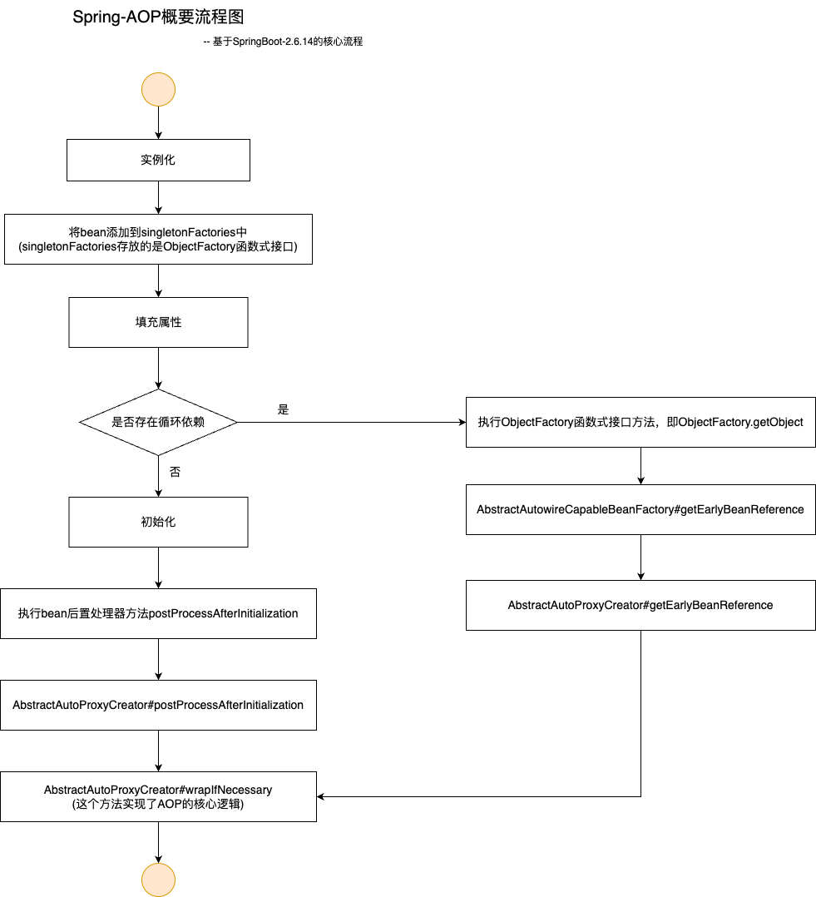

# AOP的介绍

AOP可以在不改变原目标类的前提下，实现一些通用的逻辑，如日志，还可以对目标类进行增强，如事务支持。

AOP的三要素分别是切面、切点、通知。切面中定义了切点和通知，切点用于声明切入的范围，通知用于实现切入目标的后续操作。

AOP主要是通过代理来实现的，Java中的代理又分为静态代理、动态代理，其中动态代理又有jdk提供的动态代理，以及cglib提供的动态代理。如需详细的了解，可以参考https://cloud.tencent.com/developer/article/1461796，这篇文章的介绍还是比较详细的。

# Spring AOP的实现

通常情况下，Spring是在bean完成初始化之后，通过bean后置处理器，实现对bean的代理。如果出现了循环依赖，则会提前创建bean的代理类。

## 概要流程图



## 未出现循环依赖

通常情况下，bean在完成初始化之后，会通过调用applyBeanPostProcessorsAfterInitialization方法执行bean后置处理器的postProcessAfterInitialization方法。

```java
// org.springframework.beans.factory.support.AbstractAutowireCapableBeanFactory#initializeBean
protected Object initializeBean(String beanName, Object bean, @Nullable RootBeanDefinition mbd) {
  if (System.getSecurityManager() != null) {
    AccessController.doPrivileged((PrivilegedAction<Object>) () -> {
      invokeAwareMethods(beanName, bean);
      return null;
    }, getAccessControlContext());
  }
  else {
    invokeAwareMethods(beanName, bean);
  }

  Object wrappedBean = bean;
  if (mbd == null || !mbd.isSynthetic()) {
    wrappedBean = applyBeanPostProcessorsBeforeInitialization(wrappedBean, beanName);
  }

  try {
    invokeInitMethods(beanName, wrappedBean, mbd);
  }
  catch (Throwable ex) {
    throw new BeanCreationException(
        (mbd != null ? mbd.getResourceDescription() : null),
        beanName, "Invocation of init method failed", ex);
  }
  if (mbd == null || !mbd.isSynthetic()) {
    wrappedBean = applyBeanPostProcessorsAfterInitialization(wrappedBean, beanName);
  }

  return wrappedBean;
}
```

```java
// org.springframework.beans.factory.support.AbstractAutowireCapableBeanFactory#applyBeanPostProcessorsAfterInitialization
public Object applyBeanPostProcessorsAfterInitialization(Object existingBean, String beanName)
    throws BeansException {

  Object result = existingBean;
  for (BeanPostProcessor processor : getBeanPostProcessors()) {
    Object current = processor.postProcessAfterInitialization(result, beanName);
    if (current == null) {
      return result;
    }
    result = current;
  }
  return result;
}
```

其中有一个InfrastructureAdvisorAutoProxyCreator的后置处理器，它继承了AbstractAdvisorAutoProxyCreator。它的postProcessAfterInitialization方法如下面代码中所示，其中的wrapIfNecessary方法，就是实现AOP的核心方法。

它首先找出所有实现Advisor接口的bean，然后找出对当前bean有效的advisors，最后创建当前bean的代理。

```java
// org.springframework.aop.framework.autoproxy.AbstractAutoProxyCreator#postProcessAfterInitialization
public Object postProcessAfterInitialization(@Nullable Object bean, String beanName) {
  if (bean != null) {
    Object cacheKey = getCacheKey(bean.getClass(), beanName);
    if (this.earlyProxyReferences.remove(cacheKey) != bean) {
      return wrapIfNecessary(bean, beanName, cacheKey);
    }
  }
  return bean;
}
```

```java
// org.springframework.aop.framework.autoproxy.AbstractAutoProxyCreator#wrapIfNecessary
protected Object wrapIfNecessary(Object bean, String beanName, Object cacheKey) {
  if (StringUtils.hasLength(beanName) && this.targetSourcedBeans.contains(beanName)) {
    return bean;
  }
  if (Boolean.FALSE.equals(this.advisedBeans.get(cacheKey))) {
    return bean;
  }
  if (isInfrastructureClass(bean.getClass()) || shouldSkip(bean.getClass(), beanName)) {
    this.advisedBeans.put(cacheKey, Boolean.FALSE);
    return bean;
  }

  // Create proxy if we have advice.
  Object[] specificInterceptors = getAdvicesAndAdvisorsForBean(bean.getClass(), beanName, null);
  if (specificInterceptors != DO_NOT_PROXY) {
    this.advisedBeans.put(cacheKey, Boolean.TRUE);
    Object proxy = createProxy(
        bean.getClass(), beanName, specificInterceptors, new SingletonTargetSource(bean));
    this.proxyTypes.put(cacheKey, proxy.getClass());
    return proxy;
  }

  this.advisedBeans.put(cacheKey, Boolean.FALSE);
  return bean;
}
```

## 出现了循环依赖

Spring通过三级缓存，在bean实例化之后，通过ObjectFactory函数式接口将其put到容器的singletonFactories中，此时bean还没有完成属性填充和初始化。待完成初始化之后，创建其代理，将其put到容器的singletonObjects中，并将其从singletonFactories中移除，singletonObjects中的bean都是可用的bean。而如果出现了循环依赖，此时bean还没有完成属性填充和初始化，则会调用其函数式接口，执行其中的getEarlyBeanReference方法。getEarlyBeanReference方法中，找出实现了SmartInstantiationAwareBeanPostProcessor接口的bean，并执行getEarlyBeanReference方法。这里还是InfrastructureAdvisorAutoProxyCreator这个后置处理器，其getEarlyBeanReference方法中调用了wrapIfNecessary方法来实现AOP。

```java
// org.springframework.beans.factory.support.AbstractAutowireCapableBeanFactory#doCreateBean
protected Object doCreateBean(String beanName, RootBeanDefinition mbd, @Nullable Object[] args)
    throws BeanCreationException {
    ...省略了部分代码逻辑
    
    if (earlySingletonExposure) {
			if (logger.isTraceEnabled()) {
				logger.trace("Eagerly caching bean '" + beanName +
						"' to allow for resolving potential circular references");
			}
			addSingletonFactory(beanName, () -> getEarlyBeanReference(beanName, mbd, bean));
		}
    
    ...省略了部分代码逻辑
}
```

```java
// org.springframework.beans.factory.support.AbstractAutowireCapableBeanFactory#getEarlyBeanReference
protected Object getEarlyBeanReference(String beanName, RootBeanDefinition mbd, Object bean) {
  Object exposedObject = bean;
  if (!mbd.isSynthetic() && hasInstantiationAwareBeanPostProcessors()) {
    for (SmartInstantiationAwareBeanPostProcessor bp : getBeanPostProcessorCache().smartInstantiationAware) {
      exposedObject = bp.getEarlyBeanReference(exposedObject, beanName);
    }
  }
  return exposedObject;
}
```

```java
// org.springframework.aop.framework.autoproxy.AbstractAutoProxyCreator#getEarlyBeanReference
public Object getEarlyBeanReference(Object bean, String beanName) {
  Object cacheKey = getCacheKey(bean.getClass(), beanName);
  this.earlyProxyReferences.put(cacheKey, bean);
  return wrapIfNecessary(bean, beanName, cacheKey);
}
```

# AspectJ实现方式

SpringBoot通过AopAutoConfiguration引入AnnotationAwareAspectJAutoProxyCreator，该类会扫描项目中所有有@Aspect注解的类，生成对应的advisor。

