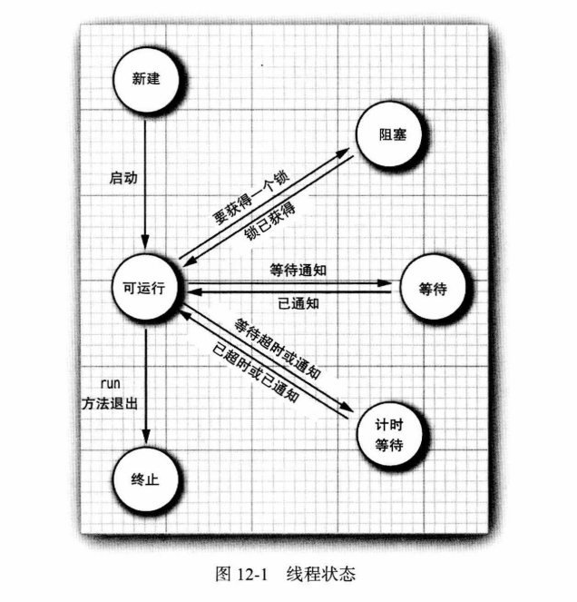
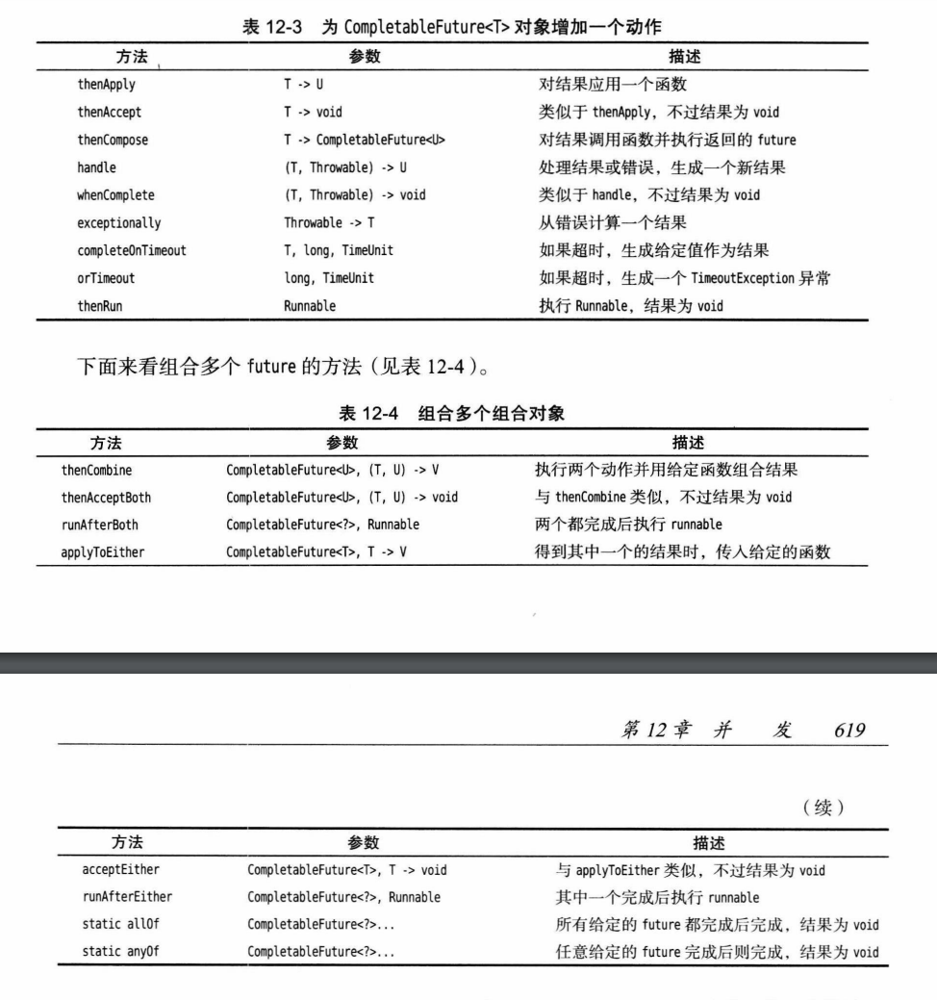

## 线程的状态

- New（新建）
- Runnable（可运行）
- Blocked（阻塞）
- Waiting（等待）
- Time waiting（计时等待）
- Terminated（终止）

#### 新建线程

当用new操作符创建一个新线程时，如new Thread(r)，这个线程还没有开始运行，还没有调用线程的start方法。

#### 可运行的线程

一旦调用start方法，线程就处于可运行（runnable）状态。一个可运行的线程可能正在运行也可能没有运行。要有操作系统为线程提供具体的运行时间。（不过，Java规范没有将正在运行作为一个单独的状态。一个正在运行的线程任然处于可运行状态。）

#### 阻塞和等待线程

当线程处于阻塞或等待状态时，它暂时是不活动的。它不运行任何代码，而且消耗最少的资源。要由线程调度器重新激活这个线程。具体细节取决于它是怎样到达非活动转态的。

**阻塞**：当一个线程试图获取一个内部的对象锁（而不是java.util.concurrent库中的Lock），而这个锁目前被其他线程占有，该线程就会被阻塞。当所有其他线程都释放了这个锁，而且线程调度器允许该线程持有这个锁时，它将变成非阻塞状态。

**等待**：当线程等待另一线程通知调度器出现一个条件时，这个线程会进入等待状态。调用Object.wait方法或Thread.join方法，或者是等待java.util.concurrent库中的Lock或Condition时，就会出现这种情况。

**计时等待**：有几个方法有超时参数，调用这些方法会让线程进入计时等待（timed waiting）状态。这一状态将一直保持到超时期满或者接收到释放的通知，带有超时参数的方法有Thread.sleep和计时版的Object.wait、Thread.join、Lock.tryLock以及Condition.await。

## 终止线程

线程会由于以下两个原因之一而终止：

- run方法正常退出，线程自然终止；
- 因为没有捕获的异常终止了run方法，使线程意外终止。

## 中断线程

当线程的run方法执行方法体中最后一条语句后再执行return语句返回时，或者出现了方法中没有捕获的异常时，线程将终止。

**inerrupt()**：可以用来请求终止一个线程，调用该方法将会设置线程的中断状态。每个线程都应该不时地检查这个标志，以判断线程是否被中断。但是，如果线程被阻塞，就无法检查中断状态，当在一个被sleep或wait调用阻塞的线程上调用interrunt方法时，那个阻塞调用（即sleep或wait调用）将被一个InterruntedException异常中断（有一些阻塞I/O调用不能被中断，对此应该考虑选择可中断的调用）。

## 守护线程

守护线程唯一的用途就是为其他线程提供服务。当只剩下守护线程时，虚拟机就会退出。因为如果只剩下守护线程，就没有必要继续运行程序了。

## 同步

#### 锁对象

- Lock/Condition
- synchronized

#### 条件对象

通常，线程进入临界区后却发现只有满足了某个条件之后它才能执行。可以使用一个条件对象（由于历史原因也叫条件变量）来管理那些已经获得了一个锁却不能做有用工作的线程。

## 线程安全的集合

#### 阻塞队列

- ArrayBlockingQueue（循环数组）
- LinkedBlockingQueue（链表）
- LinkedBlockingDeque（链表，双向）
- DelayQueue
- PriorityBlockingQueue（堆）
- BlockingQueue（接口）
- BlockingDeque（接口）
- TransferQueue（接口）

#### 高效的映射、集合队列

- ConcurrentLinkedQueue

​		构造一个可以被多线程安全访问的无上限的非阻塞队列。

- ConcurrentSkipListSet

​		构造一个可以被多线程安全访问的有序集。

- ConcurrentHashMap

​		构造一个可以被多线程安全访问的散列映射表。

- ConsurrentSkipListMap

​		构造一个可以被多线程安全访问的有序映射表。

## 任务和线程池

#### Runnable与Callable

- Runnable封装一个异步运行的任务，可以把它想象成一个没有参数和返回值的异步方法。
- Callable与Runnable类似，但是有返回值。Callable接口是一个参数化的类型，只有一个方法call。执行Callable的一种方法是使用FutureTask，它实现了Future和Runnable接口，所以可以构造一个线程来运行这个任务。更常见的情况是，可以将Callable传递到一个执行器。

#### java.util.concurrent.Executors

- ExecutorService newCachedThreadPool()

  返回一个缓存线程池，会在必要的时候创建线程，如果线程已经空闲60秒则终止该线程。

- ExecutorService newFixedThreadPool(int threads)

  返回一个线程池，使用给定数目的线程执行任务。

- ExecutorService newSingleThreadExecutor()

​		返回一个执行器，它在一个单独的线程中顺序地执行任务。

- ScheduledExecutorService newScheduledThreadPool(int threads)

​		返回一个线程池，使用给定数目的线程调度任务。

- ScheduledExecutorService newSingleThreadScheduledEcecutor()

​		返回一个执行器，在一个单独的线程中调度任务。

#### java.util.concurrent.ExecutorService

- Future<T> submit(Callable<T> task)

​		Future<T> submit(Runnable task, T result)

​		Future<?> submit(Runnable task)

​		提交指定的任务来执行。

- void shutdown()

​		关闭服务，完成已经提交的任务但不再接受新的任务。

- T invokeAny(Collection<Callable<T>> tasks)

​		T invokeAny(Collection<Callable<T>> tasks, long timeout, TimeUnit unit)

​		执行给定的任务，返回其中一个任务的结果。如果超时，第二个方法会抛出一个TimeoutException异常。

- List<Future<T>> invokeAll(Collection<Callable<T>> tasks)

​		List<Future<T>> invokeAll(Collection<Callable<T>> tasks, long timeout, TimeUnit unit)

​		执行给定的任务，返回所有任务的结果。如果超时，第二个方法会抛出一个TimeoutException异常。

#### java.util.concurrent.ThreadPoolExecutor

- Int getLargestPoolSize()

​		返回该执行器生命周期中线程池的最大大小。

#### java.util.concurrent.ScheduledExecutorService

- ScheduledFuture<V> schedule(Callable<V> task, long time, TimeUnit unit)

​		ScheduledFuture<?> schedule(Runnable task, long time, TimeUnit unit)

​		调度在指定的时间之后执行任务。

- ScheduledFuture<?> scheduleAtFixedRate(Runnable task, long initialDelay, long period, TimeUnit unit)

​		调度在初始延迟之后，周期性地运行给定的任务，周期长度是period个单位。

- ScheduledFuture<?> scheduleWithFixedDelay(Runnable task, long initialDelay, long delay, TimeUnit unit)

​		调度在初始延迟之后周期性地运行给定的任务，在一次调用完成和下一次调用开始之间有长度为delay个单位的延迟。

#### java.util.concurrent.ExecutorCompletionService<V>

- ExecutorCompletionService(Executor e)

​		构造一个执行器完成服务来收集给定执行器的结果。

- Future<V> submit(Callable<V> task)

​		Future<V> submit(Runnable task, V result)

​		提交一个任务给底层的执行器。

- Future<V> take()

​		移除并返回下一个已完成的结果，如果没有可用的已完成结果，则阻塞。

- Future<V> poll()

​		Future<V> poll(long time, TimeUnit unit)

​		移除并返回下一个已完成的结果，如果没有可用的已完成结果，则返回null。第二个方法会等待给定的时间。

#### Java.util.concurrent.RecursiveTask<V>, java.util.concurrent.RecursiveAction extends java.util.concurrent.ForkJoinTask<V>

- static void invokeAll(ForkJoinTask<?> t1, ForkJoinTask<?> t2)

​		接收到很多任务分解并阻塞，直到所有这些任务全部完成。

- final V join()

​		生成结果。这里不太使用get方法得到结果，因为他可能抛出检查型异常，而在compute方法中不允许抛出这种异常。

## 异步计算

#### java.util.concurrent.CompletableFuture

​	图片摘自《Java核心技术 卷一》

