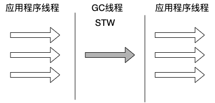
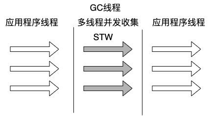
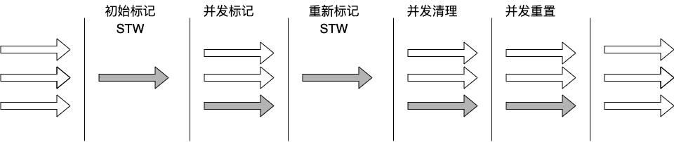

## 垃圾收集算法

- 分代收集理论
- 标记复制算法
- 标记清除算法
- 标记整理算法

#### 分代收集理论

根据对象存活周期的不同，将内存分为年轻代和老年代，年轻代又分为Eden区和Survivor区，并选用不同的垃圾收集算法。年轻代的对象存活周期短，在对年轻代内存空间进行回收时，绝大多数对象都不再存活（99%），因此选用标记复制算法。老年代的对象存活周期长，也没有额外的空间分配担保，因此选用标记清除或标记整理算法。标记清除算法和标记整理算法要比复制算法慢10倍以上。

#### 标记复制算法

标记复制算法将内存分配2块，每次使用其中的一块，当内存不够给新对象分配时，将存活的对象复制到另一边，然后对这一边的内存进行释放。

#### 标记清除算法

对存活的对象进行标记，然后将没有被标记的内存空间释放。标记清除算法会很多不连续的内存碎片。

#### 标记整理算法

先对存活的对象进行标记，但后续步骤与标记清除算法不一样，不是直接对未标记的对象进行回收，而是将被标记的存活对象往一边移动，然后对边界以外的内存空间进行释放。

## Serial收集器

Serial收集器是最基本，历史最悠久的垃圾收集器，分为年轻代收集器（SerialGC）和老年代收集器（SerialOldGC）。

年轻代采用标记复制算法，老年代采用标记整理算法。

在单线程情况下，Serial收集器比其它多线程收集器效率更高，因为它没有线程切换带来的额外开销。

**参数**：-XX:+UseSerialGC、-XX:+UseSerialOldGC。

**老年代Serial Old收集器的用途**：

1. 在JDK1.5以及以前的版本中，与Parallel Scanvenge收集器搭配使用；
2. 作为CMS收集器的后备方案。

## Parallel Scavenge收集器

Parallel Scavenge收集器可以看做是Serial收集器的多线程版本，同样分为年轻代收集器（Parallel Scavenge收集器）和老年代收集器（Parallel Old收集器）。

充分利用CPU资源，提高吞吐量，所谓吞吐量就是CPU中用于运行用户代码的时间与CPU总消耗时间的比值。默认回收线程数等于CPU核数，可以通过参数-XX:ParallelGCThreads修改，一般不建议修改。

年轻代采用标记复制算法，老年代采用标记整理算法。

Parallel Scavenge收集器和Parallel Old收集器是JDK8的默认收集器。

**参数**：-XX:+UseParallelGC(年轻代)、-XX:+UseParallelOldGC(老年代)、-XX:ParallelGCThreads(收集线程数)。

## ParNew收集器

ParNew收集器和Parallel Scavenge收集器类似，区别在于，它可以和CMS收集器配合工作。

新生代采用标记复制算法，老年代采用标记整理算法。

**参数**：-XX:+UseParNewGC。

## CMS（Concurrent Mark Sweep）收集器

并发标记清除收集器，采用标记清除算法。

分为初始标记、并发按标、重新标记、并发清理、并发重置5个步骤，其中初始标记和重新标记会Stop The World，停止应用程序线程，其余步骤GC线程和应用程序线程并行。缩短了STW的时间，提升了用户体验，由于GC线程和应用程序线程并行，虽然STW时间缩短了，但是整个GC的时间要比前面几种的收集器长。

1. **初始标记**：扫描标记GC Roots根节点，这个阶段很快，会STW；
2. **并发标记**：从GC Roots根节点触发，扫描标记引用的对象，GC线程与应用程序线程并行，时间较长，GC线程与应用程序线程会争抢CPU资源，这个阶段已经标记过的对象状态可能发生改变；
3. **重新标记**：扫描并重新标记并发标记阶段发生变化的节点，会STW，时间比初始标记阶段稍长，但是远远小于并发标记阶段。主要运用三色标记里的增量更新算法进行重新标记；
4. **并发清理**：清理未被标记的对象，GC线程与应用程序线程并行，新产生的对象将被标记为黑色；
5. **并发重置**：重置GC过程中的标记，GC线程与应用程序线程并行。

**优点**：并发收集、低停顿。

**缺点**：

1. 对CPU资源敏感，会和应用程序线程抢资源；
2. 会产生浮动垃圾，这些浮动垃圾需要等到下一次GC的时候才能被清理；
3. 采用标记清除算法，会产生内存碎片，可以通过参数XX:+UseCMSCompactAtFullCollection，让JVM在执行完标记清除后，进行内存整理；
4. GC过程中的不确定性，特别是在并发标记阶段和并发清理阶段，可能再次触发Full GC，也就是 concurrent mode failure，这个时候会Stop The World，并用Serial Old收集器完成回收。

**参数**：

-XX:+UseConcMarkSweepGC：启用cms；

-XX:ConcGCThreads：并发的GC线程数；

-XX:+UseCMSCompactAtFullCollection：FullGC之后做压缩整理（减少碎片）；

-XX:CMSFullGCsBeforeCompaction：多少次FullGC之后压缩一次，默认是0，代表每次FullGC后都会压缩一次；

-XX:CMSInitiatingOccupancyFraction:当老年代使用达到该比例时会触发FullGC（默认是92，这是百分比）；

-XX:+UseCMSInitiatingOccupancyOnly：只使用设定的回收阈值(-XX:CMSInitiatingOccupancyFraction设定的值)，如果不指定，JVM仅在第一次使用设定值，后续则会自动调整；

-XX:+CMSScavengeBeforeRemark：在CMSGC前启动一次minorgc，目的在于减少老年代对年轻代的引用（？？？），降低CMSGC的标记阶段时的开销，一般CMS的GC耗时80%都在标记阶段；

-XX:+CMSParallellnitialMarkEnabled：表示在初始标记的时候多线程执行，缩短STW；

-XX:+CMSParallelRemarkEnabled：在重新标记的时候多线程执行，缩短STW。

#### 三色标记

- **黑色**：已经被收集器访问过，且所有的引用也被扫描过，黑色对象不可能不通过灰色对象，直接引用某个白色对象；
- **灰色**：已经被收集器访问过，但是存在没有被扫描过的引用；
- **白色**：没有被收集器访问过，或不存在对该对象的引用，GC初始阶段，所有对象都是白色的。

标记阶段结束后，仍然为白色的对象，即代表不可达。

#### 多标-浮动垃圾

并发标记和并发清理阶段新产生的对象将被标记为黑色对象，这些对象以及并发标记阶段被标记为黑色的对象，也有可能变成垃圾对象，这些应该被回收而没有被回收的对象，称为浮动垃圾，只有在下一次GC时才会被回收。

#### 漏标-读写屏障

漏标是指应该被标记而没有标记的对象，这些对象一旦被回收，将产生严重的问题。可以通过增量更新（Incremental Update）和原始快照（Snapshot At The Beginning，SATB）解决。

**增量更新（Incremental Update）**：维护一张表，对黑色对象新增引用时，记录下新增的引用，在重新标记阶段，对这些对象重新扫描；

**原始快照（Snapshot At The Beginning，SATB）**：维护一张表，当对灰色对象删除指向白色对象的引用时，将原始的引用记录下来，并在重新标记阶段，扫描这些白色对象，将这些白色对象直接标记成黑色对象，这些白色对象有可能是浮动垃圾，将在下一次GC时回收。

无论是新增引用还是删除引用，虚拟机的记录操作都是通过写屏障实现的。

**读屏障**：读取对象的成员变量时，一律记录下来。

**HotSpot不同垃圾收集器对并发标记阶段漏标情况的处理方案**：

CMS：写屏障+增量更新；

G1、Shenandoah：写屏障+原始快照（SATB）；

ZGC：读屏障。

**为什么CMS用增量更新的方式解决漏标，而G1用原始快照（SATB）？**

1. 原始快照不需要再做深度扫描，而增量更新需要再做深度扫描，所以原始快照效率比增量更新高；
2. G1的内存分为很多region，存在跨region的引用，CMS就一块老年代内存，G1做深度扫描的成本比CMS高；
3. 原始快照会产生更多的浮动垃圾，G1一般用在8G以上的较大内存配置上，CMS一般用在4-8G的内存配置上。

#### 记忆集与卡表

记忆集是对跨代或者跨区域引用，在被引用区维护指向引用区的指针的数据结构。

当对年轻代内存进行回收时，对于老年代对年轻代的引用，通过记忆集，只需要扫描对年轻代有引用的老年代的区域。

卡表是HopSpot对记忆集的实现，通过字节数组实现。数组中每个元素标识一个卡页，卡页中有多个对象，卡页中只要有一个对象存在跨代引用，其对应的卡表就标识为1，否则标识为0。HotSpot的卡页大小为2^9，即512K。HotSpot通过写屏障来维护卡表。
