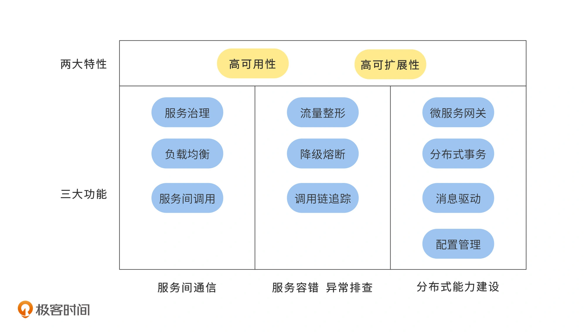
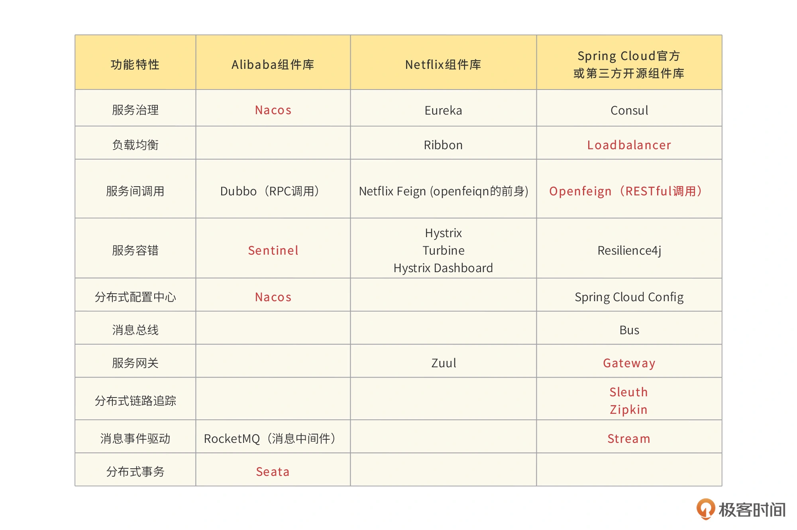
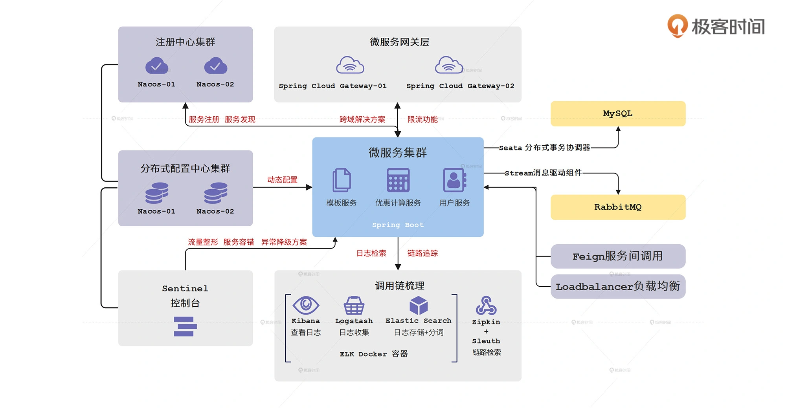

# 什么是微服务

通过应用领域模型等理论，将庞大的单体应用拆分为更细力度的小型服务，每个服务都可以独立部署、测试和发布。比如，将一个商城系统，拆分为商品服务、订单服务、促销服务、用户服务等，甚至可以进一步拆分，拆分后的每个服务独立部署，并且拥有独立的资源。

# 为什么需要微服务

**单体应用存在的问题**

1. 项目成员多，代码冲突概率高，沟通成本高
2. 回归测试成本高
3. 每次发布一旦出现问题，必须回滚整个应用，无法单独回滚这个小改动
4. 一旦发生内存泄露等问题，将影响整个应用

如果应用微服务架构对一个较大的应用进行拆分，就可以解决上述这些问题。但是微服务也有一些问题需要我们去解决，如服务治理、数据一致性、服务容错等。不过，使用各种Spring Cloud组件，可以一一解决这些问题。

# 认识Spring Cloud

一个完善的微服务架构，包含“三大功能，两大特性”。

*【图片摘自极客时间】*

## Spring Cloud组件

*【图片摘自极客时间】*

## Spring Cloud架构

*【图片摘自极客时间】*