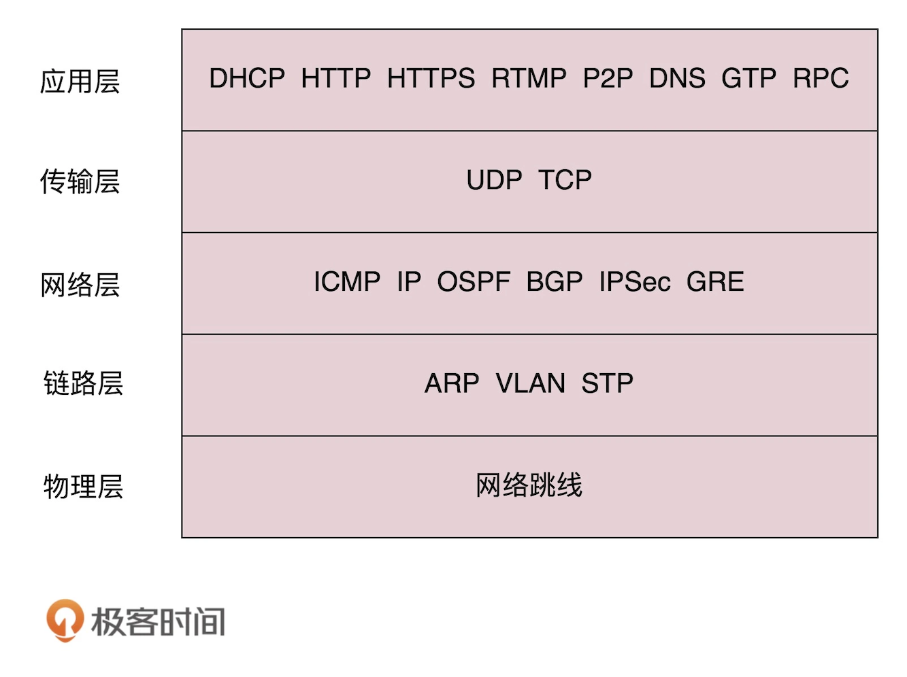
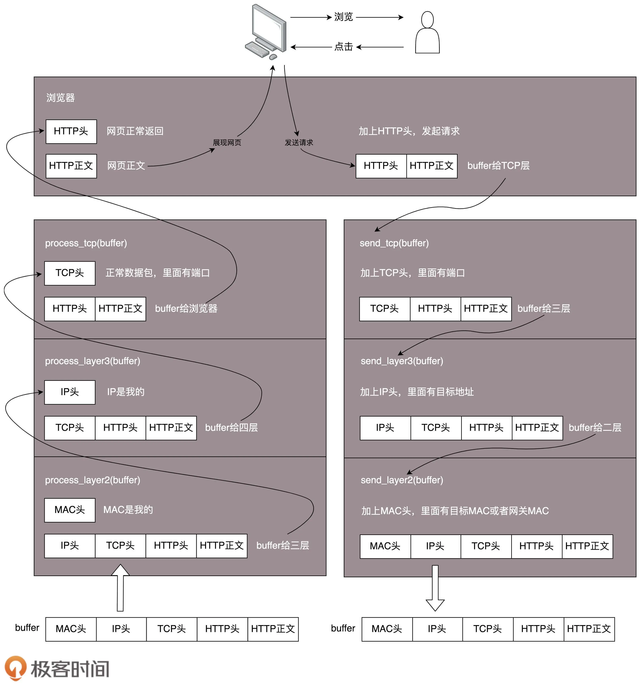

# 1、网络协议与网络分层

## 什么是协议2

人与计算机沟通，需要通过协议，只有通过协议，计算机才能知道我们要让它做什么。

**协议3要素**

* **语法**：就是这一段内容要符合一定的规则和格式。例如，括号要成对，结束要使用分号等。
* **语义**：就是这一段内容要代表某种意义。例如数字减去数字是有意义的，数字减去文本一般来说就没有意义。
* **顺序**：就是先干啥，后干啥。例如，可以先加上某个数值，然后再减去某个数值。

## 5层网络结构及对应的协议

## 程序是如何工作的

## 小结

始终牢记一个原则：只要是在网络上跑的包，都是完整的。可以有下层没上层，绝对不可能有上层没下层。
